# Architecture

## Context

Aegis separates decision-making from effects so an interrupted incident
investigation can be explained, resumed, and audited. Its reference product is
an enterprise incident-response agent. Layer 1 established package and trust
boundaries. Layers 2–3 add identity/governance and the PostgreSQL ledger.
Layer 4 adds Redis Streams delivery, PostgreSQL-authoritative leases/fencing,
bounded fair workers, cancellation, retry/DLQ, and reconciliation protocols.
Layer 5 adds the provider-neutral model gateway and cost governance. Layer 6
adds durable read-only evidence acquisition, immutable ingestion, and
deterministic correlation. Layer 7 adds governed specialist execution,
ledger-only typed reasoning artifacts, deterministic fan-out/fan-in, and critic
gates. Layer 8 adds exact-scope approval, controlled action execution,
reconciliation, and explicit postcondition verification. Layer 9 adds a separate
fenced, approval-bound ephemeral sandbox for bounded analysis and change
preparation. Memory arrives later.

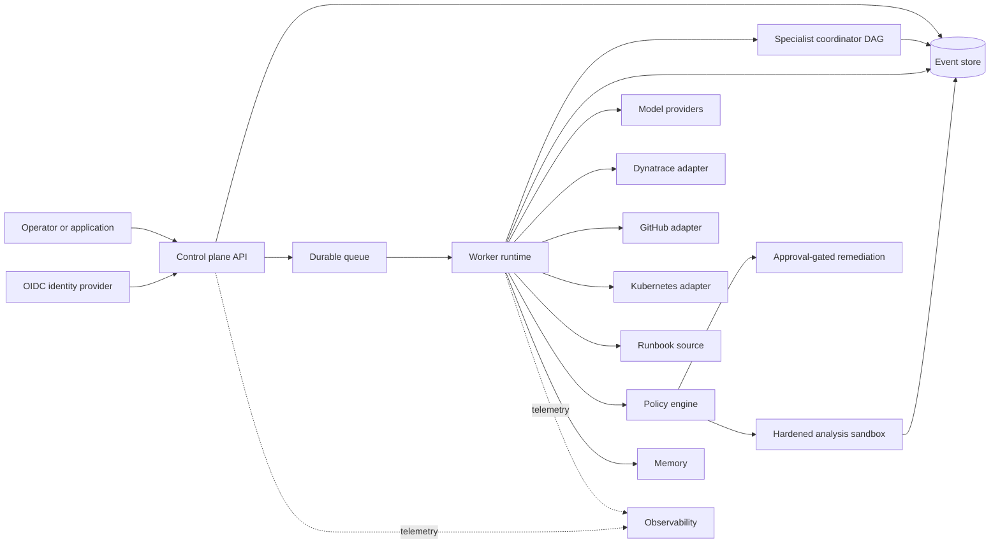

Dashed paths are diagnostic, never authoritative. PostgreSQL is truth; Redis is
only at-least-once transport. Queue/lease and model gateway execution are
implemented. Connector acquisition and deterministic correlation are also
implemented. Governed specialist reasoning and approval-gated controlled
remediation are implemented with deterministic fake acceptance scenarios. The
only official write adapter is a fixed-shape Kubernetes deployment
rollout-restart. The sandbox has a deterministic fake backend and a hardened
Kubernetes Job adapter, but production cluster controls and connectivity are not
configured or verified.

## Model gateway data flow

The Layer 5 flow is documented in
[Provider-neutral model gateway](model-gateway.md). Route decision,
`model.call_requested.v1`, and `model.budget_reserved.v1` commit under the
current worker fence before an OpenAI/Anthropic network call. Result, normalized
usage, versioned charge, and released capacity commit under the same fence
before a response is surfaced. PostgreSQL migration `0004_model_gateway.sql`
adds RLS-protected reservation and usage projections; events remain truth.

## Evidence acquisition and correlation data flow

The Layer 6 flow is documented in
[Evidence connectors and deterministic correlation](evidence-connectors.md).
`evidence.query_requested.v1` and durable work/outbox state commit before any
external read. The worker validates its lease token and generation before
querying and again before recording results or advancing a cursor. Connector
responses pass through bounded canonicalization, redaction, SHA-256 addressing,
tenant deduplication, classification, and quarantine.

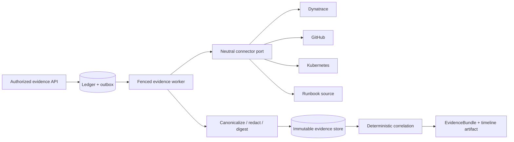

Only bounded redacted metadata enters events. Complete logs, traces, diffs, and
runbooks do not. Retained raw payloads require encrypted external
`aegis-object://` references. Correlation uses typed IDs and bounded
clock-skew/resource heuristics; ambiguity and source conflicts remain visible
and temporal proximity is never labeled causality.

## Governed specialist orchestration data flow

Layer 7 uses one Layer 4 work aggregate and active lease for an investigation.
The coordinator records an immutable plan with fixed roles and code-defined
capabilities. Every dispatch intent commits before the specialist engine runs;
the model gateway separately commits its call intent and budget reservation
before provider I/O. Artifacts and terminal task outcomes append under the same
lease token/generation fence.

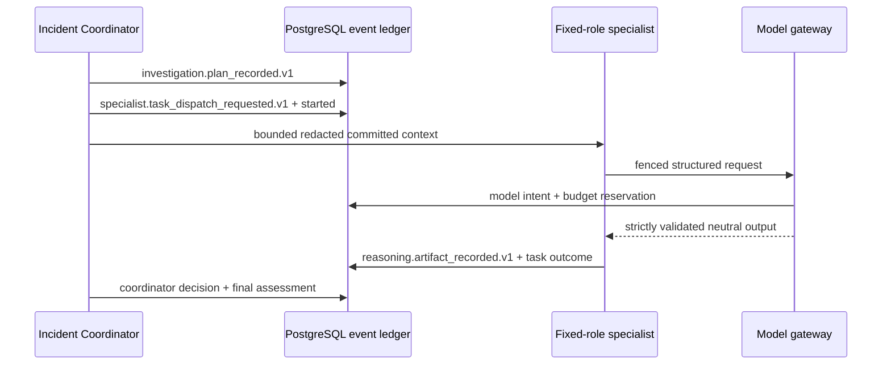

The pure fold validates gapless aggregate order, duplicate event/idempotency
keys, declared dependencies, cycles, role/output transitions, artifact linkage,
provenance reachability, citations, token accounting, and critic/finalization
gates. Ready nodes sort by plan ordinal and ID; parallel completion order cannot
change ledger append order or the conclusion. Cancellation, bounded retries,
timeouts, budget exhaustion, stale fencing, and malformed/provider-bug outcomes
remain explicit events. PostgreSQL `agent_*` and reasoning-artifact projections
use forced RLS and can be rebuilt; they are not authoritative.

## Approval-gated controlled remediation data flow

Layer 8 consumes an immutable Layer 7 proposal without giving the proposing
agent approval authority. The plan revision binds exact action and target
digests to a tenant policy snapshot. Policy is deny-by-default. Human decisions
are authenticated, tenant-authorized, separation-of-duties checked, expiring,
revocable, and quorum-based for high risk.

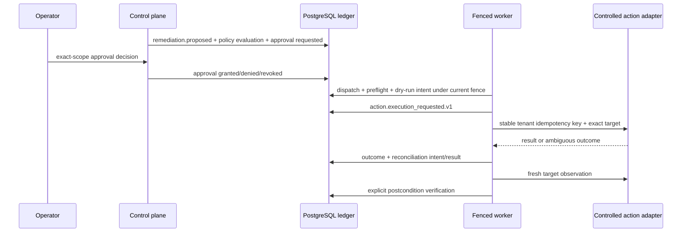

The executor rechecks authorization, policy digest, approval scope/expiry,
current approver roles, target identity, cancellation, preconditions, and lease
token/generation immediately before intent. A crash after provider application
but before outcome append is recovered by read-after-write reconciliation before
any retry. Effects are at-least-once and may remain ambiguous; exactly-once is
not claimed. PostgreSQL migration `0007_remediation_approvals.sql` supplies
forced-RLS rebuildable projections, immutable decision rows, quotas, and
tenant-scoped effect claims. Redis remains transport only.

Artifacts cover evidence assessments, primary and alternative hypotheses,
contradictions/critiques, causal-graph and timeline references, remediation
recommendations, verification plans, coordinator decisions, and final incident
assessments. Remediation is proposal-only. The fake CLI/evals use no network,
credentials, live model, or effect adapter.

## Distributed delivery and worker data flow

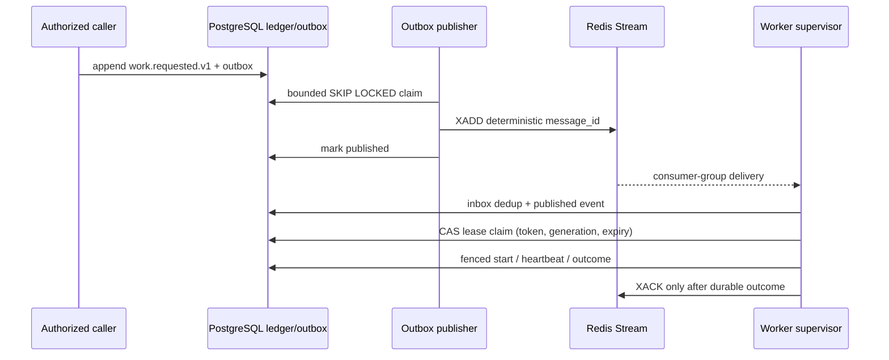

A crash after `XADD` but before PostgreSQL acknowledgement republishes the same
logical message. The inbox absorbs duplicates. Redis ownership never authorizes
a result: every state-changing worker append checks the current PostgreSQL lease
token and generation. See [Reliable distributed work](worker-runtime.md).

## Package boundaries

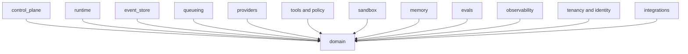

`domain` imports no other platform package. Infrastructure-facing packages
depend inward on domain types. PostgreSQL adapters live under `event_store` and
`persistence`; model SDKs are isolated to `providers/openai.py` and
`providers/anthropic.py`; database/vendor types never enter domain contracts.

`integrations.dynatrace`, `integrations.github`, `integrations.kubernetes`, and
`integrations.runbooks` translate external APIs or documents into
provider-neutral tenant-scoped evidence. The official Kubernetes client is
isolated in `integrations.kubernetes.official`. Investigation logic cannot
import vendor SDK objects or credentials.

`agents.coordination` and `agents.artifacts` remain deterministic and
provider-neutral. `agents.service` composes the event, work, gateway, policy,
evidence, telemetry, and persistence boundaries. Model SDK objects stop in
`providers`; PostgreSQL objects stop in `agents.postgres`.

## Identity, tenancy, and governance boundary

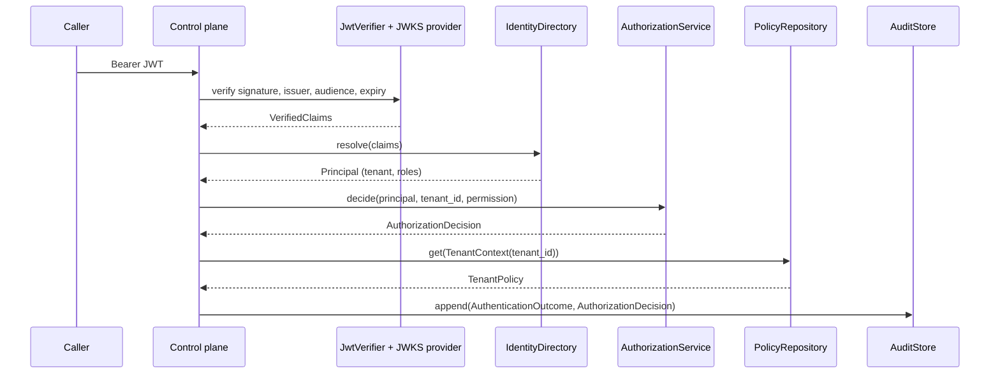

This is an implemented vertical slice, not a design sketch, proven by a
committed automated negative-test suite (`tests/test_identity_security.py`,
`tests/test_policy_security.py`, `tests/test_audit_secrets.py`,
`tests/test_migrations.py`, and cross-tenant/authentication cases in
`tests/test_api.py`, plus live PostgreSQL integration coverage). `identity.models`
defines provider-neutral, normalized identifiers (`TenantId`, `UserId`,
`ServiceIdentity`), a fixed `Role`/`Permission` set, time-bound `RoleBinding`s
(`assigned_at`/`expires_at`/`revoked_at`), and a `Principal` that must resolve
to exactly one internal user or service identity whose role bindings all match
its own tenant.

**Authentication (`identity.authentication`).** `JwtVerifier` validates
signature, algorithm allowlist, `iss`, `aud`, `exp`/`iat` with bounded clock
skew, and requires `kid`-addressed key lookup through a small `JwksProvider`
port. Two providers exist: `StaticJwksProvider` is a deterministic in-memory
fixture used by tests and local development with no network dependency, and
`RemoteJwksProvider` is a small cached HTTPS adapter compatible with a
Keycloak realm's JWKS endpoint, sourced from the existing
`AEGIS_OIDC_ISSUER`/`AEGIS_OIDC_JWKS_URL`/`AEGIS_OIDC_AUDIENCE` settings. Once a
token verifies, `AuthenticationService` resolves the verified claims against an
authoritative local `IdentityDirectory` — it never trusts a caller-supplied
identity or tenant header, and rejects unknown, disabled, or tenant-mismatched
subjects with a classified, secret-safe `AuthenticationError`. Whether a real
Keycloak realm is reachable over the network is a deployment concern; the
verifier and directory are exercised end to end today using deterministic RSA
key fixtures and in-memory identity records, with no live IdP call required.

**Authorization (`identity.authorization`).** `AuthorizationService.decide` is
a pure function that denies cross-tenant access before it ever inspects a
permission, then checks only role bindings active at a caller-supplied instant
against a fixed `ROLE_PERMISSIONS` table (`viewer`, `investigator`, `approver`,
`operator`, `tenant_admin`, `platform_admin`). The result is a fully auditable
`AuthorizationDecision` with the allow/deny outcome, reason, tenant, permission,
and the active roles considered — deny-by-default, never inferred from
resource payloads.

**Tenancy (`tenancy`).** `TenantContext` only ever wraps a validated `TenantId`
and every repository port (`TenantRepository`, `PolicyRepository`,
`AuditStore`) accepts that trusted context as an explicit parameter rather than
reading a tenant identifier out of request data.

**Governance, policy, and quotas (`policy`).** `TenantPolicy` is a versioned,
per-tenant document with allowlists for models, tools, connectors, and
environments; a maximum risk level; a risk threshold above which approval is
required; an explicit approver-role set; and `QuotaLimits` (per-run token/cost
ceilings, tenant-period token/cost ceilings, and a concurrency ceiling).
`PolicyEvaluator.evaluate` is a pure, deterministic function with no I/O: it
combines allowlist checks, risk comparison, and quota arithmetic against
caller-supplied `QuotaUsage` to return an auditable `PolicyDecision`
(`allow`/`deny`/`require_approval`, reasons, and required approver roles).
Layer 5 now records authoritative model token/cost usage and maintains a
rebuildable budget projection. Other quota classes remain caller-supplied until
their runtimes emit durable usage.

**Audit (`audit`).** Security events use additive, versioned type names
(`security.authentication_outcome.v1`, `security.authorization_decision.v1`,
`security.policy_evaluation.v1`, `security.approval_identity_recorded.v1`,
`security.administrative_change.v1`); existing names are never repurposed, only
new ones added. Every `AuditEvent` unconditionally redacts fields whose keys
look like credentials, tokens, prompts, or secrets, and scrubs inline bearer
values from any remaining string content, before the frozen dataclass is
constructed — a caller cannot bypass redaction. `InMemoryAuditStore` remains a
test adapter; `PostgresAuditStore` persists the same contract behind forced RLS
and an immutable-row trigger.

**Secrets (`secrets_boundary`).** Tools and adapters carry a `SecretReference`
(provider, name, optional version) rather than raw material. `SecretValue`
never exposes its bytes through `repr`/`str`; only an explicit `.reveal()` call
at the adapter boundary returns them. `EnvironmentSecretProvider` only resolves
names prefixed `AEGIS_SECRET_` from an explicit environment snapshot — it does
not implicitly read arbitrary process environment variables. This is a local
development provider, not a secret broker; a vault-backed provider remains
planned.

**Durable persistence.** `migrations/0001_identity_governance.sql` creates
`tenants`, `identities`, `role_bindings`, `tenant_policies`, `tenant_quotas`,
and `security_audit_events` tables. Row-level security is enabled and forced
on every tenant-scoped table. `0002_durable_ledger.sql` adds events, aggregate
heads, inbox/outbox, projection checkpoints/read models, application and
maintenance roles, per-tenant commit-order locks, grants, and immutable-event
triggers. PostgreSQL identity,
tenant, policy, and audit repositories use transaction-local tenant context.
Live tests exercise RLS and immutability. Deployment must explicitly compose
these adapters; the demo application does not silently open a database.

**Control-plane API surface.** `ControlPlaneApp` composes the pieces above
behind a small route set: `/healthz` and `/health/live` for liveness,
`/readyz` and `/health/ready` for configuration readiness (unauthenticated, as
in Layer 1), `/v1/me` returning the authenticated principal's tenant and active
roles, tenant and policy routes, bounded model catalog/usage/provider-health
views, plus bounded redacted ledger, run-timeline, and run-status projection
reads. Every `/v1/*` route requires a valid bearer token; `/v1/me` returns
immediately after authentication, while the tenant-scoped routes also require a
passing authorization decision. Authentication outcomes, and authorization
outcomes where authorization runs, are recorded as audit events before a
response is returned. No other `/v1/*`
surface should be assumed until it appears in the code and its tests.

## Canonical incident: checkout failures after deployment

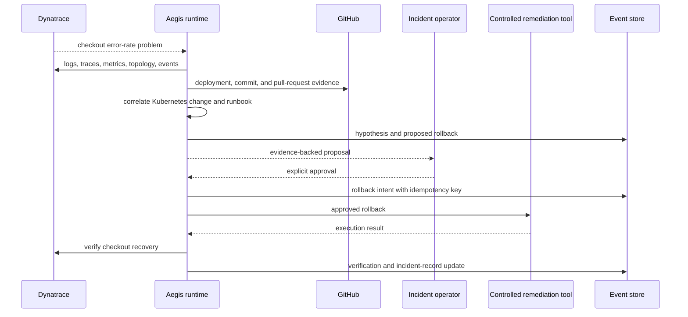

The target system starts from a Dynatrace problem indicating checkout failures
soon after a deployment. It correlates the failing trace path and error logs
with the deployment, commit, pull request, runtime rollout, topology, and
runbook. A hypothesis cites immutable evidence references and distinguishes
facts from inference. A rollback is proposed, never silently executed. After an
authorized operator approves it, a controlled tool performs the recorded
intent. Aegis then checks telemetry against an explicit recovery window and
updates the incident record with the action and result.

Layers 6–7 supply evidence acquisition/correlation and the governed hypothesis
workflow. Layer 8 supplies exact-scope approval, fake-only end-to-end execution,
one bounded official Kubernetes rollout-restart adapter, reconciliation, and
postcondition verification. Layer 9 may run only validated argv-token commands
inside an approval-bound analysis sandbox; it is not an arbitrary interactive
shell and cannot mutate production or bypass Layer 8.

## Hardened sandbox execution

The canonical request digest binds tenant, run, task, remediation
plan/action/approval, purpose, risk, canonical spec digest, exact immutable image
digest, content-addressed
inputs, mounts, environment and secret references, egress, limits, expected
outputs, retry, and cleanup. The pure fold rejects illegal lifecycle transitions
and remains authoritative; projections, claims, quotas, artifacts, cleanup rows,
and attestations are disposable views of the ledger.

Layer 8 approves a dedicated `sandbox.change_preparation.v1` action whose
immutable action digest contains the reviewed Layer 9 spec digest, policy digest,
purpose, and risk. The PostgreSQL approval authority compares those projected fields
under forced RLS; caller-supplied approver identifiers alone never establish
sandbox authority.

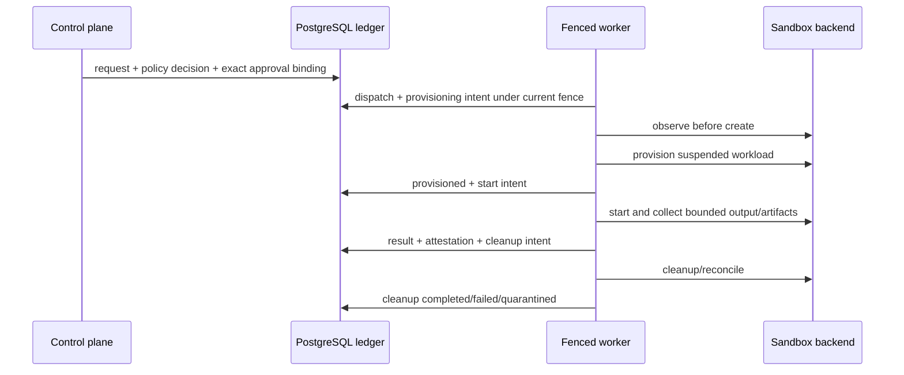

Network is none by default. Artifact and archive paths are canonicalized before
atomic staging; links, devices, traversal, bombs, conflicts, and oversized
content deny. Raw output is untrusted data and only redacted bounded metadata
enters events/APIs. The Kubernetes adapter emits a suspended digest-pinned Job
with non-root identity, read-only root filesystem, dropped capabilities, no
privilege escalation, RuntimeDefault seccomp, disabled service-account token,
no host namespaces, explicit resources/deadline, and ephemeral volumes. Admission
policy, authoritative lease-fence validation, runtime isolation, PID enforcement,
artifact collection, and default-deny networking are environment controls:
readiness is false until separately verified. See
[Hardened sandbox execution](sandbox-execution.md) and
[ADR 0016](adr/0016-hardened-ephemeral-sandbox-boundary.md).

## Multi-agent investigation topology

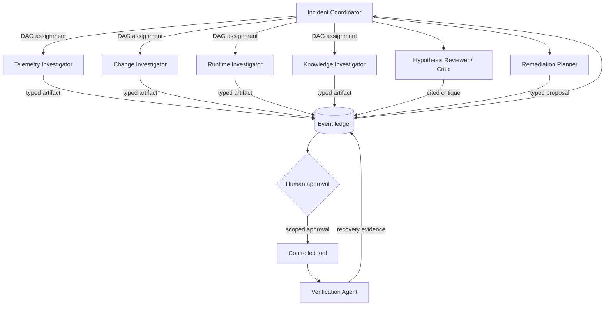

The fixed roles are:

| Role | Responsibility | Initial authority |
| --- | --- | --- |
| Incident Coordinator | Plan, state, DAG, global budget, aggregation, conflict resolution | Ledger and assignment control; no direct remediation |
| Telemetry Investigator | Dynatrace logs, metrics, traces, topology, problems, events | Read-only telemetry |
| Change Investigator | GitHub commits, pull requests, and deployments | Read-only source and delivery metadata |
| Runtime Investigator | Kubernetes events, rollout state, and relevant configuration changes | Read-only runtime metadata |
| Knowledge Investigator | Runbooks and past incident evidence | Read-only approved knowledge sources |
| Hypothesis Reviewer / Critic | Challenge citations, counter-evidence, causal claims, and confidence | Ledger read and critique write |
| Remediation Planner | Produce exact target, risk, expected result, and rollback proposal | Proposal only; no execution |
| Verification Agent | Check recovery window and update evidence after an approved action | Read-only telemetry plus verification artifact |

Specialists never call one another. The coordinator schedules a declared,
acyclic dependency graph and assigns a capability allowlist, step/token budget,
and deadline to each node. Independent read-only nodes may run concurrently.
All outputs are immutable typed artifacts committed to the ledger before another
role consumes them. Aggregation uses stable ledger order and declared conflict
rules; model arrival order cannot change authoritative state.

This is multi-agent because the work has distinct data access, failure domains,
and parallelizable expertise—not because more model conversations are presumed
better. Fixed roles avoid uncontrolled spawning; ledger mediation avoids opaque
peer chat; least privilege limits blast radius; budgets and timeouts prevent
runaway loops; citations and a critic expose unsupported consensus; deterministic
aggregation and explicit conflict handling prevent race-dependent conclusions.
Human approval separates analysis from risky action. Layer 8 binds that approval
to the planner and Verification Agent artifacts, but neither agent may approve
the action. The controlled executor records fresh verification evidence after
the effect. There is still no spawning mechanism, peer chat, or agent-controlled
approval.

## Memory architecture

Aegis uses three distinct memory tiers. **Working state/context** contains the
current plan, selected evidence, budgets, and compacted prompt context; it is
bounded and rebuildable. **Episodic memory** is the event ledger containing
incident history, specialist artifacts, approvals, intents, effects, and
verification; it is authoritative. **Semantic long-term memory** stores
tenant-scoped runbooks and curated incident knowledge with pgvector; it is a
derived retrieval surface with source citations.

All tiers carry tenant scope, provenance, classification, retention/deletion
policy, and PII controls. Retrieval balances relevance, recency, source quality,
and topology. Context compaction must retain citations, uncertainty, conflict,
approval state, and budgets; summaries never replace event history. These are future memory-layer requirements, not implemented behavior.

## Protocol positioning

Internal typed domain ports and ledger events provide correctness. MCP may later
adapt tools and context sources, but remains behind tenant authorization,
runtime policy, schema validation, credential brokering, and
intent-before-effect. A2A is planned only for external agent interoperability:
Agent Card discovery, authenticated task/message/artifact exchange,
streaming/status/cancellation, and tenant/policy propagation.

Every A2A lifecycle transition must map durably into the event ledger with
idempotency, replay protection, deadlines, and reconciliation. External agents
cannot become internal peers, spawn specialists, mutate incident state directly,
or bypass approvals. See `protocols.md` for the complete boundary and planned
conformance/security evidence.

## Durable run model

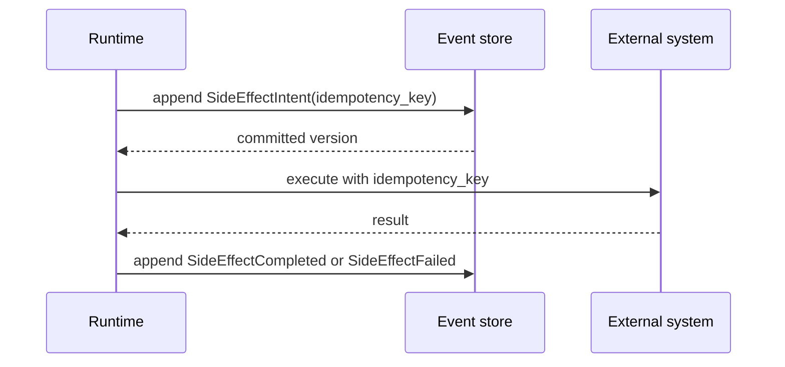

Crashes between steps are expected. Recovery reads the event stream and either
retries safely or reconciles an ambiguous effect. A trace or queue message
cannot replace the committed intent.

Layer 3 implements the ledger and intent/result contracts; Layer 4 delivers and
fences work but still has no external effect caller. Events and outbox work
commit atomically; inbox identity deduplicates delivery. Outbox and dead-letter
status are projections, not truth. See `durable-execution.md`,
`worker-runtime.md`, and ADR 0010/0011.

## Binding invariants

1. **Event log as truth:** projections and caches are disposable views.
2. **Intent before effect:** no external effect without a committed intent.
3. **Additive schemas:** never change the meaning of committed event fields.
4. **Pure domain:** deterministic transitions accept time and identifiers as
   inputs rather than obtaining them implicitly.
5. **Provider neutrality:** vendor objects do not cross adapter boundaries.
6. **Runtime safety:** budgets, policy, authorization, and sandbox constraints
   are enforced outside model output.
7. **Tenant explicitness:** each authoritative operation carries validated
   tenant context.
8. **At-least-once reality:** consumers and effects are idempotent or
   reconcilable.

## Data and trust boundaries

The browser-to-control-plane, control-plane-to-identity-provider,
runtime-to-provider, and runtime-to-sandbox paths are separate trust crossings.
Tenant input, model output, provider responses, tool output, retrieved memory,
event payloads, incident evidence, runbooks, and source-control metadata are all
untrusted until validated for their destination. A bearer token is untrusted
until `JwtVerifier` checks its signature, issuer, audience, and expiry; a
verified token is still untrusted as tenant/role authority until
`IdentityDirectory` resolves it against an authoritative local record.

PostgreSQL owns the implemented event log and durable projections. Migrations
`0001`–`0006` define identity, governance, ledger, delivery, gateway, evidence,
and specialist read models with forced row-level security. Redis is used only
where data loss cannot violate correctness. OpenTelemetry carries
correlation metadata with tenant-safe cardinality; sensitive content is
excluded by default, and audit-event redaction follows the same principle.

## Local topology

Compose provides pgvector-enabled PostgreSQL (initialized with both forward
migrations), Redis, Keycloak, an OpenTelemetry Collector,
Prometheus, Grafana, and the control-plane API. Ports bind to loopback. The API
runs as a non-root user with Linux capabilities dropped. The imported Keycloak
realm has no users and self-registration disabled; it is a config-shape
reference for the JWKS/issuer/audience abstraction, not a live-tested identity
path in the fast local checks. These are developer conveniences, not a
production deployment model.
