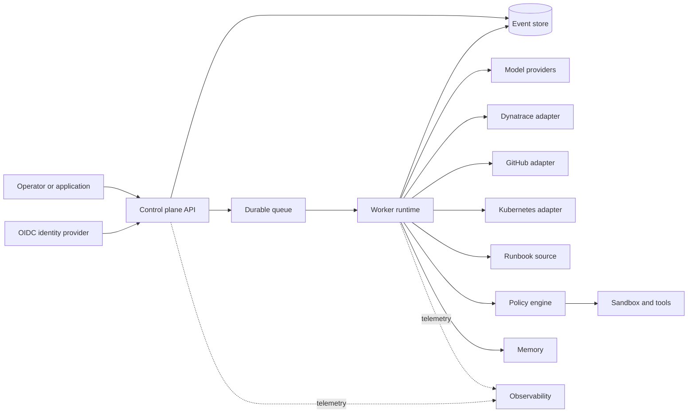
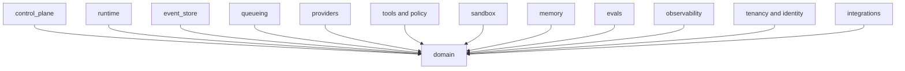
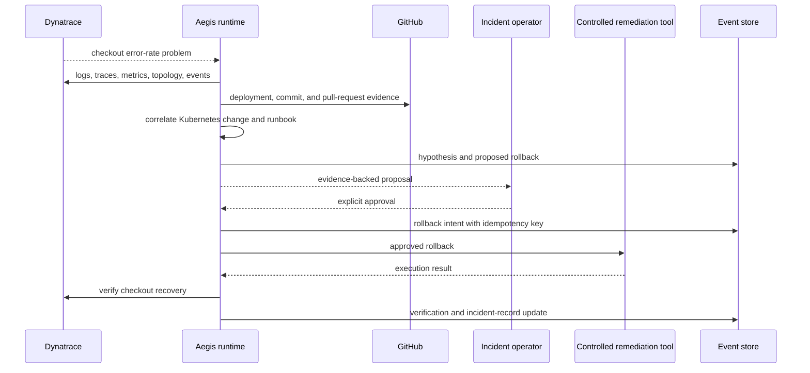
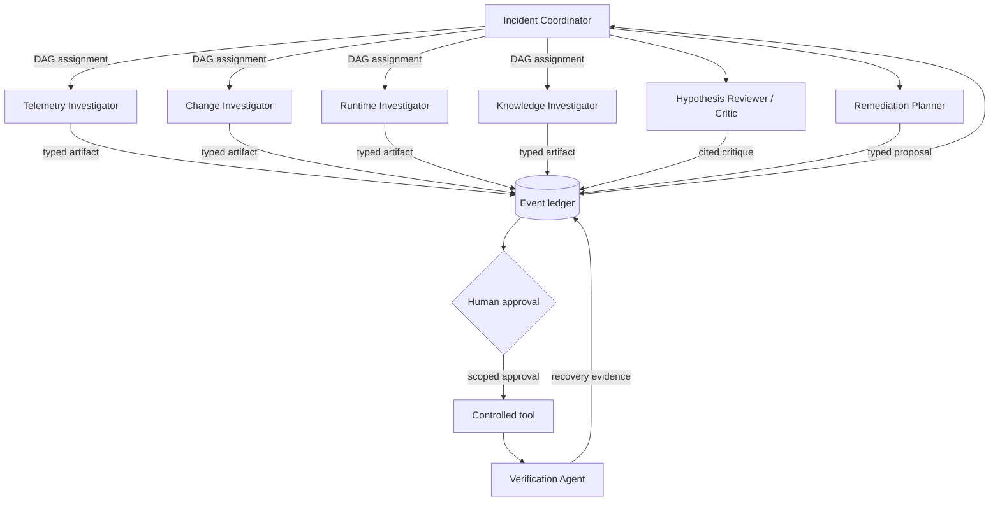
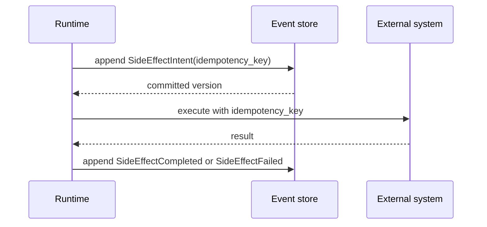

# Architecture

## Context

Aegis separates decision-making from effects so an interrupted incident
investigation can be explained, resumed, and audited. Its reference product is
an enterprise incident-response agent. Layer 1 established package and trust
boundaries. Layer 2 adds a real, test-suite-verified control-plane vertical
slice for identity, tenancy, and governance: JWT authentication, deny-by-default
tenant authorization, tenant policy/quota evaluation, and redacted audit
evidence. Connectors, durable investigation, and orchestration arrive in later
layers.



Dashed paths are diagnostic, never authoritative. The Dynatrace and GitHub
packages currently define read ports only. The control plane now authenticates
callers, enforces tenant authorization, and exposes tenant-scoped policy
inspection (see "Identity, tenancy, and governance boundary" below). Pure
policy/quota evaluation is implemented as a standalone boundary but is not
invoked by these read-only routes; the event store, durable queue, worker
runtime, providers, and connector adapters remain planned, not implemented.

## Package boundaries



`domain` imports no other platform package. Infrastructure-facing packages may
depend inward on domain types. Adapters will live under their owning boundary
and implement ports defined toward the core.

`integrations.dynatrace` and `integrations.github` expose provider-neutral,
tenant-scoped evidence contracts. Future adapters will translate vendor APIs at
those edges. Investigation logic cannot import vendor SDK objects or credentials.

## Identity, tenancy, and governance boundary

```mermaid
sequenceDiagram
  participant C as Caller
  participant CP as Control plane
  participant J as JwtVerifier + JWKS provider
  participant D as IdentityDirectory
  participant Z as AuthorizationService
  participant Q as PolicyEvaluator
  participant A as AuditStore
  C->>CP: Bearer JWT
  CP->>J: verify signature, issuer, audience, expiry
  J-->>CP: VerifiedClaims
  CP->>D: resolve(claims)
  D-->>CP: Principal (tenant, roles)
  CP->>A: append(AuthenticationOutcome)
  opt tenant or policy inspection
    CP->>Z: decide(principal, tenant_id, permission)
    Z-->>CP: AuthorizationDecision
    CP->>A: append(AuthorizationDecision, same correlation ID)
  end
  Note over Q: standalone pure boundary; no API operation invokes it yet
```

The authenticated identity, tenant, and policy-inspection path is an
implemented vertical slice, while policy/quota evaluation, audit, and secret
resolution are tested standalone boundaries. They are proven by a
committed automated negative-test suite (`tests/test_identity_security.py`,
`tests/test_policy_security.py`, `tests/test_audit_secrets.py`,
`tests/test_migrations.py`, and cross-tenant/authentication cases in
`tests/test_api.py`; 135 tests passing as of this writing). `identity.models`
defines provider-neutral, normalized identifiers (`TenantId`, `UserId`,
`ServiceIdentity`), a fixed `Role`/`Permission` set, time-bound `RoleBinding`s
(`assigned_at`/`expires_at`/`revoked_at`), and a `Principal` that must resolve
to exactly one internal user or service identity whose role bindings all match
its own tenant.

**Authentication (`identity.authentication`).** `JwtVerifier` validates
signature, algorithm allowlist, `iss`, `aud`, `exp`/`iat` with bounded clock
skew, and requires `kid`-addressed key lookup through a small `JwksProvider`
port. Two providers exist: `StaticJwksProvider` is a deterministic in-memory
fixture used by tests and local development with no network dependency, and
`RemoteJwksProvider` is a small cached HTTPS adapter compatible with a
Keycloak realm's JWKS endpoint, sourced from the existing
`AEGIS_OIDC_ISSUER`/`AEGIS_OIDC_JWKS_URL`/`AEGIS_OIDC_AUDIENCE` settings. Once a
token verifies, `AuthenticationService` resolves the verified claims against an
authoritative local `IdentityDirectory` — it never trusts a caller-supplied
identity or tenant header, and rejects unknown, disabled, or tenant-mismatched
subjects with a classified, secret-safe `AuthenticationError`. Whether a real
Keycloak realm is reachable over the network is a deployment concern; the
verifier and directory are exercised end to end today using deterministic RSA
key fixtures and in-memory identity records, with no live IdP call required.

**Authorization (`identity.authorization`).** `AuthorizationService.decide` is
a pure function that denies cross-tenant access before it ever inspects a
permission, then checks only role bindings active at a caller-supplied instant
against a fixed `ROLE_PERMISSIONS` table (`viewer`, `investigator`, `approver`,
`operator`, `tenant_admin`, `platform_admin`). The result is a fully auditable
`AuthorizationDecision` with the allow/deny outcome, reason, tenant, permission,
and the active roles considered — deny-by-default, never inferred from
resource payloads.

**Tenancy (`tenancy`).** `TenantContext` only ever wraps a validated `TenantId`
and every repository port (`TenantRepository`, `PolicyRepository`,
`AuditStore`) accepts that trusted context as an explicit parameter rather than
reading a tenant identifier out of request data.

**Governance, policy, and quotas (`policy`).** `TenantPolicy` is a versioned,
per-tenant document with allowlists for models, tools, connectors, and
environments; a maximum risk level; a risk threshold above which approval is
required; an explicit approver-role set; and `QuotaLimits` (per-run token/cost
ceilings, tenant-period token/cost ceilings, and a concurrency ceiling).
`PolicyEvaluator.evaluate` is a pure, deterministic standalone function with no
I/O: it
combines allowlist checks, risk comparison, and quota arithmetic against
tenant-bound `QuotaUsage` to return an auditable `PolicyDecision`
(`allow`/`deny`/`require_approval`, reasons, and required approver roles).
Quota *usage* accounting itself — the authoritative counters this evaluator
consumes — is a durable-runtime concern and remains planned with the Layer
3/4 event store and worker runtime.

**Audit (`audit`).** Security events use additive, versioned type names
(`security.authentication_outcome.v1`, `security.authorization_decision.v1`,
`security.policy_evaluation.v1`, `security.approval_identity_recorded.v1`,
`security.administrative_change.v1`); existing names are never repurposed, only
new ones added. Every `AuditEvent` unconditionally redacts fields whose keys
look like credentials, tokens, prompts, or secrets, and scrubs inline bearer
values from any remaining string content, before the frozen dataclass is
constructed — a caller cannot bypass redaction. `InMemoryAuditStore` is a
deterministic, tenant-scoped, append-only store used by the current vertical
slice; a durable Postgres-backed adapter is described by migration
`0001_identity_governance.sql` (see below) but not yet wired up.

**Secrets (`secrets_boundary`).** Tools and adapters carry a `SecretReference`
(provider, name, optional version) rather than raw material. `SecretValue`
never exposes its bytes through `repr`/`str`; only an explicit `.reveal()` call
at the adapter boundary returns them. `EnvironmentSecretProvider` only resolves
names prefixed `AEGIS_SECRET_` from an explicit environment snapshot — it does
not implicitly read arbitrary process environment variables. This is a local
development provider, not a secret broker; a vault-backed provider remains
planned.

**Durable persistence.** `migrations/0001_identity_governance.sql` creates
`tenants`, `identities`, `role_bindings`, `tenant_policies`, `tenant_quotas`,
and `security_audit_events` tables. Row-level security is enabled and forced
on every tenant-scoped table, with a policy requiring `tenant_id` to equal the
session's `aegis.tenant_id` setting, and an append-only trigger rejects
`UPDATE`/`DELETE`/`TRUNCATE` on `security_audit_events`. The control plane's default
repositories remain the in-memory adapters above; connecting them to this
schema, and to the event store and worker runtime, is Layer 3/4 work.

**Control-plane API surface.** `ControlPlaneApp` composes the pieces above
behind a small route set: `/healthz` and `/health/live` for liveness,
`/readyz` and `/health/ready` for configuration readiness (unauthenticated, as
in Layer 1), `/v1/me` returning the authenticated principal's tenant and active
roles, `/v1/tenants/{tenant_id}` returning the tenant record, and
`/v1/tenants/{tenant_id}/policy` returning the tenant's governance policy and
quotas. Every `/v1/*` route requires a valid bearer token and a passing
authentication check. Tenant and policy routes additionally require a passing
authorization decision; `/v1/me` returns the already-authenticated principal
without a separate permission check. Authentication outcomes are always
audited, and authorization outcomes are audited when authorization is
evaluated, using one request correlation ID. The policy route inspects stored
policy but does not invoke `PolicyEvaluator`, and no route resolves secrets.
No other `/v1/*` surface should be assumed until it appears in the code and its
tests.

## Canonical incident: checkout failures after deployment



The target system starts from a Dynatrace problem indicating checkout failures
soon after a deployment. It correlates the failing trace path and error logs
with the deployment, commit, pull request, runtime rollout, topology, and
runbook. A hypothesis cites immutable evidence references and distinguishes
facts from inference. A rollback is proposed, never silently executed. After an
authorized operator approves it, a controlled tool performs the recorded
intent. Aegis then checks telemetry against an explicit recovery window and
updates the incident record with the action and result.

Layer 1 supplies only the ports and design. It has no live evidence collection,
hypothesis engine, Kubernetes integration, approval flow, remediation tool, or
incident-system writer.

## Multi-agent investigation topology



The fixed roles are:

| Role | Responsibility | Initial authority |
| --- | --- | --- |
| Incident Coordinator | Plan, state, DAG, global budget, aggregation, conflict resolution | Ledger and assignment control; no direct remediation |
| Telemetry Investigator | Dynatrace logs, metrics, traces, topology, problems, events | Read-only telemetry |
| Change Investigator | GitHub commits, pull requests, and deployments | Read-only source and delivery metadata |
| Runtime Investigator | Kubernetes events, rollout state, and relevant configuration changes | Read-only runtime metadata |
| Knowledge Investigator | Runbooks and past incident evidence | Read-only approved knowledge sources |
| Hypothesis Reviewer / Critic | Challenge citations, counter-evidence, causal claims, and confidence | Ledger read and critique write |
| Remediation Planner | Produce exact target, risk, expected result, and rollback proposal | Proposal only; no execution |
| Verification Agent | Check recovery window and update evidence after an approved action | Read-only telemetry plus verification artifact |

Specialists never call one another. The coordinator schedules a declared,
acyclic dependency graph and assigns a capability allowlist, step/token budget,
and deadline to each node. Independent read-only nodes may run concurrently.
All outputs are immutable typed artifacts committed to the ledger before another
role consumes them. Aggregation uses stable ledger order and declared conflict
rules; model arrival order cannot change authoritative state.

This is multi-agent because the work has distinct data access, failure domains,
and parallelizable expertise—not because more model conversations are presumed
better. Fixed roles avoid uncontrolled spawning; ledger mediation avoids opaque
peer chat; least privilege limits blast radius; budgets and timeouts prevent
runaway loops; citations and a critic expose unsupported consensus; deterministic
aggregation and explicit conflict handling prevent race-dependent conclusions.
Human approval separates analysis from risky action, and the Verification Agent
prevents a successful tool response from being mistaken for incident recovery.

Layer 1 provides role, artifact, assignment, budget, and ledger interfaces only.
There is no scheduler, agent execution, aggregation, conflict resolver, approval
service, or spawning mechanism.

## Memory architecture

Aegis uses three distinct memory tiers. **Working state/context** contains the
current plan, selected evidence, budgets, and compacted prompt context; it is
bounded and rebuildable. **Episodic memory** is the event ledger containing
incident history, specialist artifacts, approvals, intents, effects, and
verification; it is authoritative. **Semantic long-term memory** stores
tenant-scoped runbooks and curated incident knowledge with pgvector; it is a
derived retrieval surface with source citations.

All tiers carry tenant scope, provenance, classification, retention/deletion
policy, and PII controls. Retrieval balances relevance, recency, source quality,
and topology. Context compaction must retain citations, uncertainty, conflict,
approval state, and budgets; summaries never replace event history. These are
Layer 6 requirements, not implemented behavior.

## Protocol positioning

Internal typed domain ports and ledger events provide correctness. MCP may later
adapt tools and context sources, but remains behind tenant authorization,
runtime policy, schema validation, credential brokering, and
intent-before-effect. A2A is planned only for external agent interoperability:
Agent Card discovery, authenticated task/message/artifact exchange,
streaming/status/cancellation, and tenant/policy propagation.

Every A2A lifecycle transition must map durably into the event ledger with
idempotency, replay protection, deadlines, and reconciliation. External agents
cannot become internal peers, spawn specialists, mutate incident state directly,
or bypass approvals. See `protocols.md` for the complete boundary and planned
conformance/security evidence.

## Durable run model



Crashes between steps are expected. Recovery reads the event stream and either
retries safely or reconciles an ambiguous effect. A trace or queue message
cannot replace the committed intent.

## Binding invariants

1. **Event log as truth:** projections and caches are disposable views.
2. **Intent before effect:** no external effect without a committed intent.
3. **Additive schemas:** never change the meaning of committed event fields.
4. **Pure domain:** deterministic transitions accept time and identifiers as
   inputs rather than obtaining them implicitly.
5. **Provider neutrality:** vendor objects do not cross adapter boundaries.
6. **Runtime safety:** budgets, policy, authorization, and sandbox constraints
   are enforced outside model output.
7. **Tenant explicitness:** each authoritative operation carries validated
   tenant context.
8. **At-least-once reality:** consumers and effects are idempotent or
   reconcilable.

## Data and trust boundaries

The browser-to-control-plane, control-plane-to-identity-provider,
runtime-to-provider, and runtime-to-sandbox paths are separate trust crossings.
Tenant input, model output, provider responses, tool output, retrieved memory,
event payloads, incident evidence, runbooks, and source-control metadata are all
untrusted until validated for their destination. A bearer token is untrusted
until `JwtVerifier` checks its signature, issuer, audience, and expiry; a
verified token is still untrusted as tenant/role authority until
`IdentityDirectory` resolves it against an authoritative local record.

PostgreSQL will own the event log and durable projections; migration
`0001_identity_governance.sql` already defines its tenant, identity,
role-binding, policy, quota, and append-only audit tables with row-level
security, ahead of the durable event store landing in Layer 3. Redis will be
used only where data loss cannot violate correctness. OpenTelemetry carries
correlation metadata with tenant-safe cardinality; sensitive content is
excluded by default, and audit-event redaction follows the same principle.

## Local topology

Compose provides pgvector-enabled PostgreSQL (now initialized with the
identity/governance migration), Redis, Keycloak, an OpenTelemetry Collector,
Prometheus, Grafana, and the control-plane API. Ports bind to loopback. The API
runs as a non-root user with Linux capabilities dropped. The imported Keycloak
realm has no users and self-registration disabled; it is a config-shape
reference for the JWKS/issuer/audience abstraction, not a live-tested identity
path in the fast local checks. These are developer conveniences, not a
production deployment model.
