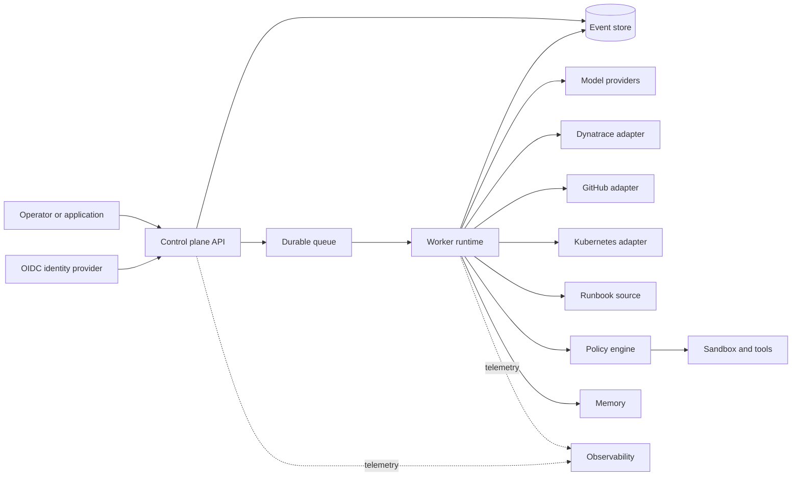
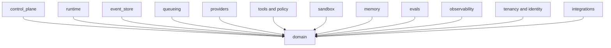
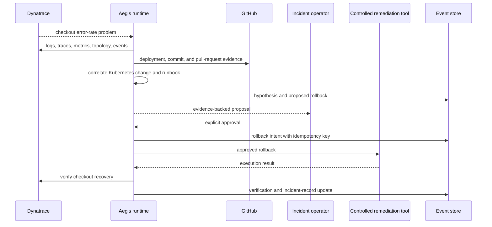
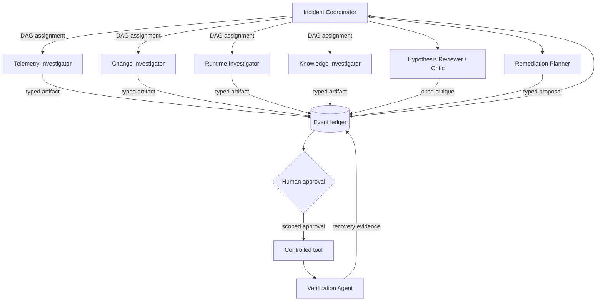
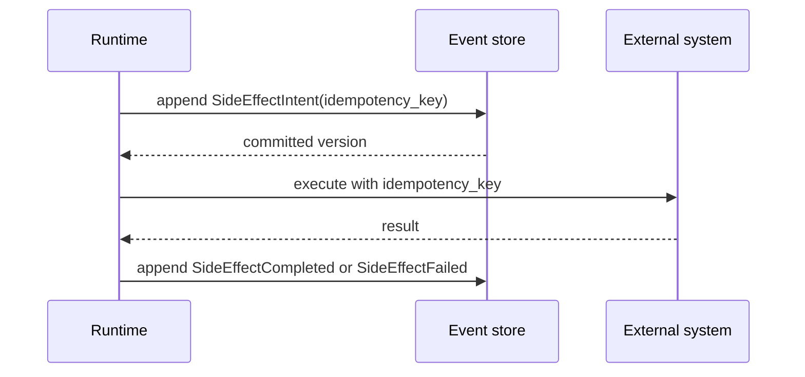

# Architecture

## Context

Aegis separates decision-making from effects so an interrupted incident
investigation can be explained, resumed, and audited. Its reference product is
an enterprise incident-response agent. Layer 1 establishes package and trust
boundaries; connectors, investigation, and orchestration arrive in later layers.

Dashed paths are diagnostic, never authoritative. The Dynatrace and GitHub
packages currently define read ports only. Boxes beyond health and configuration
contracts are planned, not implemented.

## Package boundaries

`domain` imports no other platform package. Infrastructure-facing packages may
depend inward on domain types. Adapters will live under their owning boundary
and implement ports defined toward the core.

`integrations.dynatrace` and `integrations.github` expose provider-neutral,
tenant-scoped evidence contracts. Future adapters will translate vendor APIs at
those edges. Investigation logic cannot import vendor SDK objects or credentials.

## Canonical incident: checkout failures after deployment

The target system starts from a Dynatrace problem indicating checkout failures
soon after a deployment. It correlates the failing trace path and error logs
with the deployment, commit, pull request, runtime rollout, topology, and
runbook. A hypothesis cites immutable evidence references and distinguishes
facts from inference. A rollback is proposed, never silently executed. After an
authorized operator approves it, a controlled tool performs the recorded
intent. Aegis then checks telemetry against an explicit recovery window and
updates the incident record with the action and result.

Layer 1 supplies only the ports and design. It has no live evidence collection,
hypothesis engine, Kubernetes integration, approval flow, remediation tool, or
incident-system writer.

## Multi-agent investigation topology

The fixed roles are:

| Role | Responsibility | Initial authority |
| --- | --- | --- |
| Incident Coordinator | Plan, state, DAG, global budget, aggregation, conflict resolution | Ledger and assignment control; no direct remediation |
| Telemetry Investigator | Dynatrace logs, metrics, traces, topology, problems, events | Read-only telemetry |
| Change Investigator | GitHub commits, pull requests, and deployments | Read-only source and delivery metadata |
| Runtime Investigator | Kubernetes events, rollout state, and relevant configuration changes | Read-only runtime metadata |
| Knowledge Investigator | Runbooks and past incident evidence | Read-only approved knowledge sources |
| Hypothesis Reviewer / Critic | Challenge citations, counter-evidence, causal claims, and confidence | Ledger read and critique write |
| Remediation Planner | Produce exact target, risk, expected result, and rollback proposal | Proposal only; no execution |
| Verification Agent | Check recovery window and update evidence after an approved action | Read-only telemetry plus verification artifact |

Specialists never call one another. The coordinator schedules a declared,
acyclic dependency graph and assigns a capability allowlist, step/token budget,
and deadline to each node. Independent read-only nodes may run concurrently.
All outputs are immutable typed artifacts committed to the ledger before another
role consumes them. Aggregation uses stable ledger order and declared conflict
rules; model arrival order cannot change authoritative state.

This is multi-agent because the work has distinct data access, failure domains,
and parallelizable expertise—not because more model conversations are presumed
better. Fixed roles avoid uncontrolled spawning; ledger mediation avoids opaque
peer chat; least privilege limits blast radius; budgets and timeouts prevent
runaway loops; citations and a critic expose unsupported consensus; deterministic
aggregation and explicit conflict handling prevent race-dependent conclusions.
Human approval separates analysis from risky action, and the Verification Agent
prevents a successful tool response from being mistaken for incident recovery.

Layer 1 provides role, artifact, assignment, budget, and ledger interfaces only.
There is no scheduler, agent execution, aggregation, conflict resolver, approval
service, or spawning mechanism.

## Memory architecture

Aegis uses three distinct memory tiers. **Working state/context** contains the
current plan, selected evidence, budgets, and compacted prompt context; it is
bounded and rebuildable. **Episodic memory** is the event ledger containing
incident history, specialist artifacts, approvals, intents, effects, and
verification; it is authoritative. **Semantic long-term memory** stores
tenant-scoped runbooks and curated incident knowledge with pgvector; it is a
derived retrieval surface with source citations.

All tiers carry tenant scope, provenance, classification, retention/deletion
policy, and PII controls. Retrieval balances relevance, recency, source quality,
and topology. Context compaction must retain citations, uncertainty, conflict,
approval state, and budgets; summaries never replace event history. These are
Layer 6 requirements, not implemented behavior.

## Protocol positioning

Internal typed domain ports and ledger events provide correctness. MCP may later
adapt tools and context sources, but remains behind tenant authorization,
runtime policy, schema validation, credential brokering, and
intent-before-effect. A2A is planned only for external agent interoperability:
Agent Card discovery, authenticated task/message/artifact exchange,
streaming/status/cancellation, and tenant/policy propagation.

Every A2A lifecycle transition must map durably into the event ledger with
idempotency, replay protection, deadlines, and reconciliation. External agents
cannot become internal peers, spawn specialists, mutate incident state directly,
or bypass approvals. See `protocols.md` for the complete boundary and planned
conformance/security evidence.

## Durable run model

Crashes between steps are expected. Recovery reads the event stream and either
retries safely or reconciles an ambiguous effect. A trace or queue message
cannot replace the committed intent.

## Binding invariants

1. **Event log as truth:** projections and caches are disposable views.
2. **Intent before effect:** no external effect without a committed intent.
3. **Additive schemas:** never change the meaning of committed event fields.
4. **Pure domain:** deterministic transitions accept time and identifiers as
   inputs rather than obtaining them implicitly.
5. **Provider neutrality:** vendor objects do not cross adapter boundaries.
6. **Runtime safety:** budgets, policy, authorization, and sandbox constraints
   are enforced outside model output.
7. **Tenant explicitness:** each authoritative operation carries validated
   tenant context.
8. **At-least-once reality:** consumers and effects are idempotent or
   reconcilable.

## Data and trust boundaries

The browser-to-control-plane, control-plane-to-identity-provider,
runtime-to-provider, and runtime-to-sandbox paths are separate trust crossings.
Tenant input, model output, provider responses, tool output, retrieved memory,
event payloads, incident evidence, runbooks, and source-control metadata are all
untrusted until validated for their destination.

PostgreSQL will own the event log and durable projections. Redis will be used
only where data loss cannot violate correctness. OpenTelemetry carries
correlation metadata with tenant-safe cardinality; sensitive content is excluded
by default.

## Local topology

Compose provides pgvector-enabled PostgreSQL, Redis, Keycloak, an OpenTelemetry
Collector, Prometheus, Grafana, and the health-only API. Ports bind to loopback.
The API runs read-only as a non-root user with Linux capabilities dropped.
These are developer conveniences, not a production deployment model.
