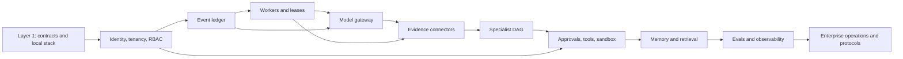

# Enterprise implementation blueprint

## Purpose

“Enterprise-grade” is a measurable target, not a description of Layer 1. Aegis
earns that label only after the controls in this plan are implemented and backed
by executable evidence. The foundation PR establishes boundaries that make the
work reviewable; this blueprint defines how every current limitation is closed.

The target product is a multi-tenant incident-response agent that investigates
checkout failures after a deployment, correlates evidence, proposes a bounded
remediation, obtains approval, executes through controlled tools, verifies
recovery, and updates the incident record.

## Enterprise completion standard

A capability is not complete because its happy path works. It must have:

1. **A typed contract** with tenant, identity, provenance, and correlation
   semantics.
2. **Durable state transitions** that replay after process or regional failure.
3. **Authorization and policy enforcement** outside model output.
4. **Failure semantics** for timeout, retry, duplication, stale ownership,
   partial response, cancellation, and ambiguous external outcomes.
5. **Security evidence** covering cross-tenant, injection, privilege, secret,
   supply-chain, and audit threats relevant to the capability.
6. **Operational evidence** through metrics, traces, logs, SLOs, alerts,
   runbooks, capacity limits, backup, restore, and rollback.
7. **Evaluation evidence** with deterministic, adversarial, and quality tests.
8. **Documentation** linking implementation, tests, dashboards, runbooks, and
   remaining risk.

No roadmap item moves from Planned to Implemented without these artifacts.

## Delivery dependency graph

Security, threat modeling, migration safety, and failure injection run through
every layer. Layers may overlap in development, but a dependent capability
cannot claim completion before its prerequisite gate passes.

## Planned implementation slices

Each slice is intended to be a reviewable PR with one primary acceptance gate.

| ID | Layer | Slice | Depends on | Primary exit evidence |
| --- | --- | --- | --- | --- |
| EP-01 | 2 | OIDC verification and principal model | Layer 1 | issuer/audience/expiry/key-rotation tests |
| EP-02 | 2 | Tenant membership, RBAC, and PostgreSQL isolation | EP-01 | cross-tenant API and database denial suite |
| EP-03 | 3 | Append-only event store and additive schema registry | EP-02 | concurrency, immutability, and historical replay tests |
| EP-04 | 3 | Deterministic incident state machine and projections | EP-03 | crash-point replay and projection rebuild |
| EP-05 | 3 | Transactional command, intent, inbox, and outbox handling | EP-03 | duplicate and ambiguous-effect recovery tests |
| EP-06 | 4 | Fenced lease queue and worker lifecycle | EP-03 | stale-writer, renewal, worker-death, and DLQ tests |
| EP-07 | 5 | Provider routing, budgets, metering, and reconciliation | EP-05, EP-06 | adapter contract and cost-limit tests |
| EP-08 | 6 | Dynatrace, GitHub, Kubernetes, and runbook read adapters | EP-02, EP-06 | fixture, rate-limit, pagination, provenance tests |
| EP-09 | 7 | Coordinator DAG and fixed specialist runtime | EP-04, EP-06, EP-07, EP-08 | deterministic parallel aggregation and timeout tests |
| EP-10 | 8 | Policy engine, exact approvals, and controlled tools | EP-05, EP-09 | no-action-before-approval and replay-denial tests |
| EP-11 | 8 | Isolated sandbox and capability-scoped credentials | EP-10 | escape, egress, quota, cleanup, and secret tests |
| EP-12 | 9 | Three-tier memory, pgvector retrieval, and compaction | EP-02, EP-04 | tenant isolation, provenance, deletion, fidelity tests |
| EP-13 | 10 | Evaluation harness and release-quality gates | EP-09–EP-12 | known regressions blocked by deterministic/adversarial suites |
| EP-14 | 10 | Production telemetry, audit, SLOs, and cost controls | EP-03–EP-13 | dashboards, alerts, trace/event correlation, SLO burn tests |
| EP-15 | 11 | Deployment, secrets, backup/restore, HA, and multi-region | EP-14 | signed release, restore/failover, capacity evidence |
| EP-16 | 11 | MCP adapters and external A2A interoperability | EP-10, EP-14, EP-15 | conformance, tenant, replay, cancellation, malicious-peer tests |

## EP-01–EP-02: Identity, tenancy, and RBAC

Layer 2 implements the EP-01 verification/principal core and the EP-02
application authorization model, tenant-scoped repository contracts, SQL
schema, RLS policies, and negative application tests. The live Keycloak
rotation/revocation drill still remains before the full EP-01/EP-02 operational
exit gate can be claimed. PostgreSQL-backed adapters, separate database roles,
and the database-level cross-tenant denial suite are implemented in this layer.

### Implementation

- Validate OIDC signatures using cached JWKS with bounded refresh and fail-closed
  behavior. Enforce issuer, audience, expiry, not-before, algorithm allowlist,
  and clock-skew policy.
- Normalize the authenticated subject into `Principal`; do not trust tenant or
  role claims as authorization by themselves.
- Resolve principal-to-tenant membership from authoritative storage and create a
  `TenantContext` bound to the requested action and resource.
- Model tenant roles and permissions explicitly. Initial roles are incident
  viewer, investigator, approver, remediator, tenant administrator, and platform
  operator.
- Require tenant context in repositories, event streams, work claims, policy
  decisions, connector credentials, telemetry, audit, memory, and tool calls.
- Add PostgreSQL row-level security as defense in depth with separate migration,
  application, projection, and read-only roles.
- Record authorization decisions with principal, tenant, action, resource,
  policy version, reason, and correlation ID without logging raw tokens.

### Tests and evidence

- Reject wrong issuer/audience, expired/future tokens, unsupported algorithms,
  stale keys, malformed claims, and unavailable key refresh.
- Attempt cross-tenant reads, writes, event appends, queue claims, connector
  access, memory retrieval, approval, and tool use at both application and
  database layers.
- Prove role changes and tenant removal take effect within a documented cache
  bound.
- Add key-rotation and emergency-revocation runbooks.

### Exit gate

No authenticated request can access an authoritative resource without explicit
tenant authorization, and the negative test matrix proves isolation.

## EP-03–EP-05: Event persistence and durable orchestration

**Layer 3 delivery status (2026-08):** EP-03 persistence, EP-04 generic
projection/checkpoint mechanics, and EP-05 inbox/outbox transaction mechanics are
implemented in `event_store.postgres`, `projections`, and migration `0002`.
Live PostgreSQL tests prove expected-version races, rollback, append-only rows,
RLS denial, replay, inbox deduplication, outbox claim/dead-letter behavior, and
projection rebuild. The incident-specific state machine, external effects, and
ambiguous-effect reconciliation remain planned; their exit gates are not claimed.

**Layer 4 worker delivery status (2026-08):** EP-06 is implemented for reliable
work delivery: shared Redis Streams, deterministic message identity, PostgreSQL
inbox/outbox, CAS leases with token/generation fencing, heartbeat/reclaim,
bounded fair supervision, Layer 2 concurrency quotas, cancellation, timeout,
retry/DLQ, authorized operations, reconciliation protocol, fixed telemetry, and
live Redis/PostgreSQL races. EP-07 is implemented in Layer 5 with neutral
contracts, OpenAI/Anthropic/mock adapters, tenant routing, fenced reservations,
versioned charges, resilience, strict schemas, and deterministic evaluations.
EP-08 connectors are implemented in Layer 6. EP-09 specialist/coordinator
execution is implemented in Layer 7 with proposal-only remediation.

### EP-07 implemented evidence

- `model.call_requested.v1` and `model.budget_reserved.v1` precede provider I/O;
  all gateway events are additive and legacy replay is unchanged.
- Migration `0004_model_gateway.sql` adds forced-RLS reservation/usage
  projections with tenant serialization, request/idempotency uniqueness, worker
  lease token/generation, and retained pricing version.
- Mocked SDK transports and scripted providers cover normalized messages/tools,
  structured output/refusal, usage classes, classified errors,
  timeout/cancellation, retry/fallback/circuits/rate/concurrency limits, budget
  races, stale fences, refunds, malformed returns, redaction, and replay.
- Raw prompts, tool values, images, keys, and SDK exception text are absent from
  events/telemetry. Billing ambiguity and missing encrypted response persistence
  remain explicit residual risks.

### EP-08 implemented evidence

**Layer 6 delivery status (2026-08):** provider-neutral evidence contracts,
durable connector-query intent, fenced lifecycle/results/cursors, bounded
Dynatrace/GitHub/Kubernetes/runbook adapters, content-addressed redacted
ingestion, quarantine, citations, asynchronous tenant APIs, and deterministic
timeline correlation are implemented. External environments remain unconfigured
and unverified. Layer 7 consumes these neutral cited contracts.

- `evidence.query_requested.v1` commits with durable work before network I/O;
  stale lease token/generation tests reject start, result, and cursor writes.
- Migration `0005_evidence_connectors.sql` adds forced-RLS query, immutable
  evidence/quarantine, fenced cursor, and bundle projections with bounded fields.
- Mocked HTTP/Kubernetes and deterministic runbook tests cover authentication,
  endpoint/repository/namespace allowlists, safe queries, pagination,
  truncation, rate limits, cancellation/timeouts, malformed/oversized payloads,
  diff/log caps, trust, redaction, deduplication, and partial results.
- Correlation tests cover UTC/clock skew, exact typed identifiers, heuristic
  rationale/confidence, ambiguity, runbook applicability, conflicts, provenance,
  and stable digests without fabricating causality.
- Production exit evidence remains open for account permissions, private egress,
  certificate validation, proxy pools, secret rotation, data residency, live API
  versions, Kubernetes RBAC, and operational dashboards/alerts.

### Storage model

PostgreSQL is the initial correctness store:

| Table | Purpose | Key constraints |
| --- | --- | --- |
| `event_streams` | aggregate version and stream metadata | `(tenant_id, aggregate_id)` unique |
| `events` | immutable ordered envelopes and payloads | event ID unique; stream version unique |
| `command_inbox` | deduplicate accepted commands/messages | tenant plus idempotency key unique |
| `effect_intents` | exact external action before execution | immutable request digest and key |
| `outbox` | transactionally publish committed work | claimed with a fenced lease |
| `projections` | rebuildable query state and checkpoints | source event position recorded |
| `schema_registry` | event versions and upcasters | additive compatibility metadata |

Payloads use versioned JSON with validation at append and read. Database
permissions prevent update/delete of committed events by the application role.
Optimistic concurrency compares expected stream version in the same transaction
that appends events and writes outbox work.

### Orchestration

- Implement incident and investigation state as pure folds over events.
- Persist typed specialist artifacts as events; do not infer authoritative state
  from transcripts or traces.
- Use a deterministic command handler that accepts explicit time, IDs, tenant,
  principal, and policy decisions.
- Write `SideEffectIntent` before provider, connector, tool, incident-system, or
  A2A calls. Record completed, failed, timed-out, cancelled, or
  reconciliation-required outcomes.
- Build projections that can be deleted and rebuilt from the ledger.
- Preserve old event readers and test every released fixture during schema
  evolution.

### Failure tests

Inject process termination before and after each transaction boundary, duplicate
commands, concurrent appends, projection crashes, poison events, delayed outbox
delivery, database failover, and ambiguous external completion. Replay must
produce identical authoritative state and must never invent a success-shaped
fallback.

### Exit gate

The checkout incident can be reconstructed from committed events after every
injected crash point, and no external effect path exists without a durable
intent.

## EP-06–EP-07: Workers, leases, providers, and cost governance

### Worker and queue design

- Claim tenant-scoped durable work with a lease ID, monotonic fence, owner,
  attempt, expiry, and heartbeat.
- Renew only the active lease; authoritative writes reject stale fences.
- Use bounded exponential backoff with jitter, error classification, maximum
  attempts, dead-letter state, and operator-visible recovery.
- Make cancellation durable. A running worker checks cancellation and deadline
  at safe interruption points.
- Treat Redis as notification/acceleration only; losing Redis cannot lose work
  or grant ownership.

### Provider routing

- Implement provider adapters behind normalized request, response, usage,
  safety, and error contracts. Streaming remains a later additive contract.
- Route using tenant policy, data classification, region, model capability,
  latency, availability, and budget—not model-generated preference.
- Enforce per-run and per-tenant-period token/cost ceilings before calls. Global
  fleet ceilings and streaming enforcement remain planned.
- Record provider/model/version, normalized usage, latency, retries, request ID,
  and estimated/actual cost.
- Use idempotency where supported; mark ambiguous outcomes for operator
  reconciliation and never claim exactly-once provider execution or billing.
- Add circuit breakers, concurrency limits, rate-limit coordination, and
  approved fallbacks that preserve classification and quality policy.

### Exit gate

Worker death, lease expiry, duplicate delivery, provider timeout, rate limit,
partial stream, budget exhaustion, and stale ownership cannot corrupt state,
exceed authority, or silently lose work.

Layer 5 proves all non-streaming cases above. Streaming, automated invoice
reconciliation, fleet-global budgets, and encrypted response artifacts remain
open and therefore the full EP-07 production operations gate is not claimed.

## EP-08: Live evidence connectors

### Dynatrace

- Add read adapters for problems, events, logs, metrics, traces, entities, and
  topology with explicit bounded time windows.
- Preserve source ID, timestamp, query, tenant mapping, environment, entity,
  retrieval time, adapter version, and immutable deep link/reference.
- Support pagination, rate limits, partial results, query cost controls,
  cancellation, redaction, and regional endpoints.

### GitHub

- Use GitHub App installation tokens with repository allowlists and read-only
  permissions for commits, pull requests, checks, deployments, and workflow
  metadata.
- Preserve repository, revision, deployment environment, actor, timestamps,
  API reference, and installation identity.
- Handle pagination, deleted/force-pushed references, installation revocation,
  secondary rate limits, and webhook duplication.

### Kubernetes/runtime

- Use tenant/environment-scoped service accounts with read-only access to
  deployments, replica sets, pods, events, rollout history, and approved
  configuration metadata.
- Never ingest Secret values. Redact environment/config values by policy.
- Record cluster identity, namespace, workload UID, resource version, and
  observation time to prevent stale-name confusion.

### Runbooks and past incidents

- Ingest only approved sources with version, owner, classification, retention,
  and provenance.
- Treat content as untrusted evidence. Instructions cannot grant capabilities or
  bypass runtime policy.

### Connector tests

Contract suites use recorded, sanitized fixtures for the checkout incident and
exercise pagination, stale cursors, malformed data, partial access, token
rotation, rate limits, timeouts, duplicate webhooks, clock skew, and source
deletion. Optional live tests run only against dedicated non-production tenants.

### Exit gate

The canonical incident is reproducible from cited evidence without live
credentials in CI, while controlled live tests prove adapter compatibility.

## EP-09: Durable multi-agent execution

**Layer 7 delivery status (2026-08): Implemented.** The `agents` package owns a
pure replay fold, immutable bounded DAG, eight fixed governed roles, typed
artifact union, deterministic readiness/order, critic/finalization gates,
fenced coordinator, model-gateway engine, fake checkout engine, tenant-RLS
PostgreSQL projections, authorized cursor APIs, bounded telemetry, fake CLI, and
CI-gated behavior evaluations. ADR 0014 records the decision.

### Coordinator

- Validate an acyclic investigation plan with fixed assignments and dependencies.
- Own incident lifecycle, global budget, deadlines, cancellation, conflict
  policy, and final deterministic aggregation.
- Dispatch only declared specialist roles; specialists cannot spawn agents,
  modify the DAG, transfer capabilities, or communicate directly.
- Commit every assignment, artifact, timeout, conflict, decision, and aggregate
  to the event ledger.

### Specialists

- Telemetry Investigator: Dynatrace evidence only.
- Change Investigator: GitHub delivery evidence only.
- Runtime Investigator: Kubernetes/runtime evidence only.
- Knowledge Investigator: approved runbooks and past incidents only.
- Hypothesis Reviewer: citations, counter-evidence, causal gaps, and confidence.
- Remediation Planner: exact proposal, target, expected result, risk, rollback.
- Verification Agent: post-action telemetry and incident-record evidence.

Each assignment receives a capability allowlist, model policy, input/output
schema, step/token/cost budget, timeout, and maximum artifact size. Investigation
roles are read-only.

### Aggregation and conflict

Artifacts require immutable citations and calibrated confidence. Aggregation
sorts by declared DAG node and ledger position rather than completion time.
Contradictions remain explicit. Deterministic policy may select, defer, or
request human resolution; it never averages conflict into false certainty.

### Exit gate

Randomized completion order, retries, duplicates, timeouts, malformed artifacts,
conflicting evidence, critic rejection, and budget exhaustion produce the same
valid incident state or an explicit unresolved outcome.

This gate is met by deterministic tests for cycles/depth/fan-out, role and
transition denial, replay corruption, citation/provenance validation, stale
fencing, cancellation, retry/recovery, timeout/provider bugs, prompt injection,
unknown citations, contradiction/critic abstention, budget exhaustion, RLS,
pagination, and projection rebuild. The behavior eval matrix covers success,
ambiguity, contradiction, budget exhaustion, and recovery without network or
credentials.

The following are not part of EP-09 and remain explicit future work: approval
service, remediation execution, isolated sandbox, memory/RAG, operator UI,
MCP/A2A, production deployment, live model calls, and live connector
certification.

## EP-10–EP-11: Remediation, approval, tools, and sandbox

### Approval model

- A proposal contains tenant, incident, hypothesis version, exact action,
  immutable parameter digest, target, expected result, risk, expiry, and
  required approver role/separation of duties.
- Approval is an authenticated ledger event bound to that proposal version.
- Editing a proposal invalidates prior approval. Approval cannot be replayed
  across tenant, incident, target, action, environment, or expiry.
- Break-glass requires stronger authentication, reason, short duration,
  additional audit, notification, and retrospective review.

### Controlled effects

- Validate typed tool input and target allowlists after approval.
- Broker short-lived, action-scoped credentials just in time; never expose
  standing credentials to a model or sandbox.
- Commit intent, execute with idempotency/fence, record raw adapter result
  safely, then reconcile and verify target state.
- Initial demo action is a bounded deployment rollback. Arbitrary shell access
  is not an acceptable remediation API.

### Sandbox

- Run untrusted code outside the worker identity using a replaceable isolation
  backend.
- Enforce non-root execution, read-only base image, ephemeral filesystem,
  seccomp/AppArmor or equivalent, CPU/memory/PID/time/output quotas,
  deny-by-default egress, destination allowlists, and no host socket.
- Destroy the environment after use and audit image digest, policy, limits,
  network decisions, and result.

### Exit gate

Prompt/runbook injection, malformed proposal, approval replay, stale approval,
target substitution, duplicate delivery, sandbox escape, forbidden egress,
resource exhaustion, and secret access all fail closed. A successful tool call
does not close the incident until independent verification passes.

## EP-12: Three-tier memory and retrieval

- **Working memory:** bounded coordinator state and compacted context, rebuildable
  from durable state.
- **Episodic memory:** authoritative incident event history and typed artifacts.
- **Semantic memory:** pgvector indexes of approved runbooks and curated incident
  knowledge with source/version citations.

Partition every record and vector by tenant. Store provenance, classification,
owner, source version, embedding model, retention, deletion state, and
ingestion policy. Retrieval combines relevance, recency, topology, source
quality, and access policy. Context compaction preserves material evidence,
conflict, uncertainty, approval state, budgets, and citations.

Deletion workflows cover source rows, vectors, derived summaries, caches,
exports, and backup expiry. Legal hold is explicit and audited. PII and secrets
are classified, minimized, redacted, or excluded before indexing/model use.

### Exit gate

Adversarial tests prove no cross-tenant retrieval, poisoned knowledge cannot
grant authority, stale content is visible, deletion propagates, and compaction
does not alter material incident meaning.

## EP-13–EP-14: Evaluation, observability, SLOs, and cost

### Evaluation

- Version checkout-incident datasets by scenario, expected evidence, acceptable
  hypotheses, prohibited claims/actions, and recovery criteria.
- Deterministically grade schemas, citations, tenant isolation, budgets,
  transition legality, approval binding, tool guards, and verification windows.
- Grade semantic evidence coverage, causal reasoning, uncertainty, remediation
  quality, and summary fidelity with calibrated human/model rubrics.
- Add adversarial cases: misleading deployment timing, prompt-injected runbook,
  conflicting telemetry, missing source, stale topology, poisoned memory,
  provider truncation, and false recovery.
- Block release on statistically and operationally meaningful regression, not a
  single aggregate score.

### Observability

- Correlate tenant-safe service, run, incident, event, assignment, lease,
  provider, connector, approval, and effect identifiers.
- Exclude prompt/evidence/tool content from metrics and default traces. Redact
  logs and bound label cardinality.
- Track command acceptance, queue lag, lease loss, projection lag, connector
  errors, provider latency/cost, budget denial, policy denial, approval latency,
  tool outcomes, verification, and evaluation drift.

### Initial SLO proposals

These are hypotheses to validate in load tests, not current guarantees:

| SLI | Initial target |
| --- | --- |
| Durable incident command acceptance | 99.9% monthly; p95 under 500 ms |
| No acknowledged command loss | 100% invariant |
| Tenant isolation or unauthorized effect | 0 tolerated |
| Projection freshness | p99 under 30 seconds |
| Investigation begins after accepted incident | p95 under 60 seconds |
| Operator-visible durable progress | 99.9% monthly |
| Approved action reaches terminal/reconciliation state | 99.9% within policy deadline |

Every SLO needs an error-budget policy, alert, dashboard, owner, dependency
mapping, and runbook. Safety invariants are not traded against availability.

## EP-15: Production deployment and enterprise operations

### Platform

- Build immutable images, generate SBOM and SLSA provenance, scan dependencies
  and images, sign artifacts, and verify signatures at admission.
- Use workload identity and a managed secret broker with rotation; no static
  production secrets in environment files.
- Deploy with least-privilege service accounts, network policies, pod security,
  disruption budgets, autoscaling, topology spread, migration jobs, and
  progressive delivery.
- Separate API, coordinator, worker pools, projection workers, and connector
  workers so authority and scaling remain bounded.

### Data resilience

- Encrypt in transit and at rest, manage keys with rotation and separation of
  duties, and audit privileged access.
- Define backup frequency, point-in-time recovery, retention, deletion, and
  restore procedures. Run restore drills with measured RPO/RTO.
- Start single-region HA. Add multi-region only after ordering, tenant routing,
  failover, split-brain prevention, provider locality, and data-residency
  decisions are tested.

### Capacity

Model incident arrival rate, evidence volume, events per incident, vector growth,
provider concurrency, connector quotas, worker service time, projection lag,
and hot-tenant skew. Load tests include burst incidents, provider degradation,
database failover, queue backlog, and one tenant attempting resource exhaustion.

### Governance

Add access reviews, audit retention, vulnerability response, dependency policy,
data classification, DPA/residency controls, incident management, change
approval, disaster recovery, and evidence mapping. Compliance is not claimed
until independently reviewed against a defined scope.

### Exit gate

A signed release survives load, restore, failover, credential rotation, rollback,
and tenant-incident drills within documented objectives, with operator runbooks
and auditable evidence.

## EP-16: MCP and A2A

MCP remains a policy-controlled tool/context adapter. A2A remains an external
agent-interoperability adapter. Neither replaces internal events, queues,
artifacts, authorization, approvals, or coordinator control.

- MCP adapters receive tenant and principal context, validate schemas, enforce
  tool allowlists, broker scoped credentials, and apply intent-before-effect.
- A2A supports validated Agent Cards, authenticated task/message/artifact
  exchange, streaming, status, cancellation, deadlines, and policy propagation.
- Map inbound/outbound A2A lifecycle transitions to ledger events. Use stable
  idempotency keys, replay protection, quotas, version negotiation, redaction,
  and ambiguous-outcome reconciliation.
- Test conformance, peer spoofing, downgrade, duplicate delivery, cancellation
  races, cross-tenant attempts, malformed artifacts, and malicious peers.

## Canonical demo acceptance progression

| Gate | Demonstrable outcome |
| --- | --- |
| Layer 2 | Only an authorized tenant investigator can open/view the incident |
| Layer 3 | Checkout incident and evidence artifacts replay after injected crashes |
| Layer 4 | Read-only specialists correlate sanitized Dynatrace/GitHub/Kubernetes fixtures deterministically |
| Layer 5 | Exact rollback requires durable scoped approval and controlled execution |
| Layer 6 | Approved runbooks/past incidents are retrieved with tenant-safe provenance |
| Layer 7 | Adversarial evaluation challenges the hypothesis; telemetry proves recovery |
| Layer 8 | Signed deployment, restore/failover drill, SLOs, audit, and optional A2A exchange pass |

## Production readiness review

Before any real tenant onboarding, reviewers must approve:

- threat model and residual risks
- tenant-isolation and authorization evidence
- event replay and side-effect recovery evidence
- connector permission and data-classification review
- approval/tool/sandbox penetration and abuse tests
- privacy, retention, deletion, and residency behavior
- evaluation baseline and known limitations
- capacity results and quota policy
- SLOs, alerts, runbooks, on-call ownership, and game-day results
- backup restore and failover evidence
- SBOM, provenance, signatures, vulnerability posture, and rollback
- customer-facing support, incident, and disclosure processes

Until that review passes, Aegis remains a learning/reference implementation, not
an enterprise production service.
