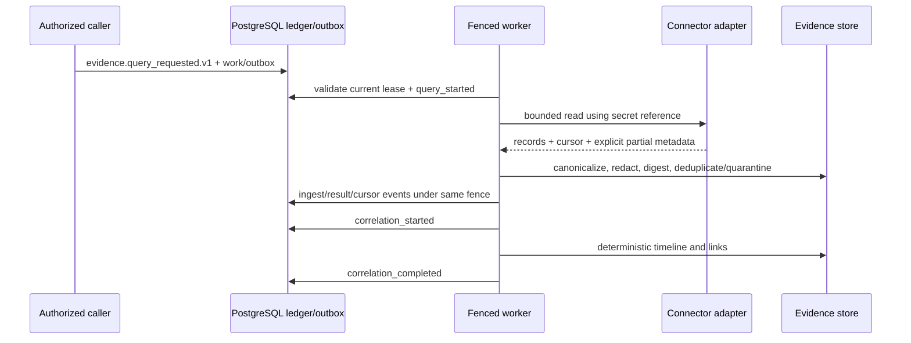

# Evidence connectors and deterministic correlation

Layer 6 implements the read-only evidence acquisition path for the canonical
checkout incident. It gathers bounded metadata from Dynatrace, GitHub,
Kubernetes, and trusted runbook sources; normalizes it into immutable
provider-neutral records; and produces a deterministic timeline for later
specialists. It does not perform LLM reasoning, infer causality, execute
runbooks, or remediate infrastructure.

The adapters are production-oriented code exercised with mocked transports and
deterministic fixtures. They are disabled by default and have not been verified
against this repository's external Dynatrace, GitHub, or Kubernetes
environments. Deployment readiness, credentials, private connectivity, and
account-specific API behavior remain operator responsibilities.

## Durable data flow

The append-only event stream is authoritative. Query intent commits before any
network read. Results, explicit partial outcomes, and source cursor advancement
require the same live PostgreSQL lease token and generation. Redis delivery,
HTTP traces, adapter logs, and read projections never establish ownership.

Events contain bounded metadata, digests, counts, provenance, redaction, and
cursor state. They never contain complete logs, traces, diffs, runbooks,
credentials, or vendor responses. Bounded redacted record content is stored in
the tenant evidence store. A retained raw payload may be represented only by an
encrypted external `aegis-object://` reference; arbitrary URLs and unbounded
payloads are rejected.

## Contract and ingestion guarantees

`domain.evidence` defines frozen provider-neutral identities, timestamps,
windows, references, provenance, classification, retention, partial-result
metadata, links, timeline entries, and bundles. Vendor SDK types terminate in
`integrations`.

Ingestion uses canonical JSON and SHA-256 content addressing. Deduplication is
tenant-scoped by digest. Credential- and PII-shaped values pass through
redaction hooks before persistence. Invalid, oversized, or untrusted records are
quarantined with bounded metadata; they are not coerced into valid evidence.
Knowledge records are explicitly distinct from observations. Citations render
the immutable evidence ID together with source/kind, digest, observed time, and
provenance URI without copying sensitive content.

## Connector tutorials

All live configurations require an explicit tenant and default to
`enabled=False`. Resolve `SecretReference` values only at the adapter boundary.
Never put token material, private keys, queries, response bodies, or arbitrary
URLs in logs or metric labels.

### Dynatrace

1. Create tenant-owned secret references for the OAuth client ID and secret.
2. Configure distinct HTTPS environment and account origins, explicit OAuth
   scopes, and bounded `ConnectorLimits`.
3. Enable only after the tenant policy allowlists `dynatrace` and the target
   environment.
4. Submit exactly one fixed evidence kind per durable query. The adapter
   constructs safe selectors and supported API paths; callers cannot submit raw
   model-generated DQL.

The adapter covers Grail logs and spans plus Environment API metrics, problems,
events, entities/topology, and deployment/change evidence where the configured
account exposes them. It enforces response/page/record/window caps, TLS origins,
OAuth2 client credentials, pagination, retry-after classification,
cancellation, timeouts, malformed-response containment, and explicit
truncation. Capability discovery reports support rather than silently using a
less secure API.

Environment API continuations are stored as opaque source cursors for that
query's single evidence kind. This prevents a continuation from one collection
from being interpreted by another. Entity/topology collection uses the fixed
`type(SERVICE)` selector; account-specific broader topology selectors are not
accepted as caller-provided DQL.

Production deployments should use tenant-specific origins, private endpoints
where available, restrictive egress DNS/IP policy, managed certificate trust,
short-lived OAuth credentials, documented rotation, and regional storage
consistent with the tenant's residency policy.

### GitHub

1. Install a least-privilege GitHub App only on approved repositories.
2. Store its private key as a tenant-owned secret reference and configure the
   app and installation IDs.
3. Populate an exact `owner/repository` allowlist and leave the connector
   disabled until tenant policy permits the source and environment.
4. Request commits, comparison metadata, pull requests/reviews/checks,
   workflows, deployments, releases, or tags. Check queries require an explicit
   allowlisted-repository commit or ref; compare queries require explicit
   `base` and `head` refs.

The adapter signs a short-lived RS256 app JWT, exchanges it for an installation
token, constrains every repository path, uses API-version headers, paginates
with opaque per-kind state, and classifies primary or secondary rate limits.
Compare responses retain only bounded commit/range/file-count metadata. Patch
bodies, unrestricted repository files, binary content, and large diffs are not
ingested. Because this layer has no representation cache, it does not issue
conditional reads; an unexpected `304` is an explicit partial result rather
than fabricated success.

GitHub webhooks are not implemented in this layer. A future webhook endpoint
must verify the exact delivery bytes with the configured signature algorithm,
bind the installation and repository to the tenant allowlist, reject stale or
replayed delivery IDs through the inbox, persist receipt before dispatch, and
return no event body or secret in diagnostics.

### Kubernetes

1. Bind the runtime to a read-only workload identity or service account.
2. Configure an exact cluster identity and namespace allowlist.
3. Keep `allow_logs=False` unless tenant policy explicitly grants sanitized log
   collection; set byte, line, and time-window caps when it is granted.
4. Grant list/get/watch only for required workload, pod, ReplicaSet, deployment,
   event, and status resources.

The official Python client is isolated in
`integrations.kubernetes.official`; the core adapter receives neutral mappings.
Names, labels, clusters, and namespaces are validated. The adapter collects
rollout revisions, workload/pod/ReplicaSet state, events, resource status,
container termination reasons, image digests, and bounded logs. Official-client
responses are streamed under the configured byte cap before JSON
deserialization. Collection-specific continuation tokens remain separate in
opaque cursors. It does not exec, mutate, read Secrets, or read ConfigMaps. If
watches are enabled later, reconnect logic must preserve bounded timeouts and
`resourceVersion`, explicitly reporting a relist or gap.

### Runbooks

1. Point `roots` only at approved `file://` fixtures or `git+https://`
   repositories.
2. Pin and allowlist content digests or repository commit provenance.
3. Require valid Markdown/YAML front matter with owner, service/environment
   applicability, safe procedures, risk, approval, version, and trust metadata.
4. Retrieve the document as knowledge; never execute its procedures.

Malformed, unsigned/untrusted, oversized, or digest-mismatched runbooks are
rejected or quarantined. Instructions inside a runbook have no authority and
cannot expand connector, model, tool, approval, or tenant policy. Local source
reads stop at the document byte cap before allocation, scan unrelated documents
within the configured page budget, and return an opaque continuation rather
than hiding applicable later runbooks.

## Deterministic correlation tutorial

`CorrelationEngine` normalizes timestamps to UTC and orders entries by time and
stable evidence ID. Exact links use trace/span/log identifiers, service and
resource identities, commit SHAs, deployment revisions, image digests, and
typed references. Bounded heuristics may link close timestamps and compatible
resources within the configured clock-skew tolerance.

Every heuristic link records confidence and rationale. Equal candidates remain
ambiguous. Contradictory source assertions become explicit source-conflict
links. Runbooks link by declared service/environment applicability. The engine
does not convert temporal proximity into causality, discard conflicts, or ask a
model to choose a winner. The resulting `EvidenceBundle` and timeline artifact
are immutable cited input for a future coordinator.

## API and operations

Authorized tenant-scoped routes submit durable work and inspect bounded
projections:

- `POST /v1/tenants/{tenant}/evidence/queries`
- `GET /v1/tenants/{tenant}/evidence/queries/{query_id}`
- `GET /v1/tenants/{tenant}/evidence/records`
- `GET /v1/tenants/{tenant}/evidence/citations`
- `GET /v1/tenants/{tenant}/evidence/capabilities`
- `GET /v1/tenants/{tenant}/evidence/bundles/{bundle_id}`

Request handlers never wait for connector I/O. Authentication establishes the
principal; evidence permissions and tenant policy separately authorize request,
read, and correlation actions. Connector allowlists, environment policy, query
windows, result caps, quotas, pagination cursors, and redacted response shapes
are runtime enforced. Record and citation cursors carry a durable insertion
high-water mark and last position. Tenant-scoped advisory locking establishes
the first-page boundary against concurrent writers, so later commits cannot
shift, duplicate, or omit records in that traversal.

Metrics use fixed names and source-kind labels only: latency/error/rate-limit/
partial counts, record and byte counts, quarantine/dedup counts, cursor
advancement, webhook verification failure, and correlation outcomes. Tenant,
resource, query, repository, namespace, and URL values are prohibited labels.

## Adding a connector

1. Add no vendor types to `domain` or `evidence`; map into the existing immutable
   contracts.
2. Implement the neutral connector port behind an injected bounded transport and
   typed disabled-by-default configuration.
3. Persist intent before I/O and require cancellation plus a valid fence before
   calling, storing results, or advancing a cursor.
4. Enforce tenant source/environment/resource allowlists and safe typed query
   construction. Never expose a raw vendor query language to a model.
5. Return pagination and partial/truncation metadata explicitly. Classify rate
   limits, timeouts, cancellation, malformed data, and permanent failures.
6. Canonicalize, redact, digest, deduplicate, classify, and quarantine through
   the shared ingestion path.
7. Add deterministic mocked transport tests for auth, isolation, caps,
   pagination, malformed/oversized data, retries, cancellation, fencing,
   provenance, and secret exclusion.
8. Document required read permissions, egress, TLS, rotation, residency, API
   versions, unsupported resources, and live-environment verification status.

## Known gaps

- No connector is automatically composed or enabled in the demo application.
- CI uses no real Dynatrace, GitHub, Kubernetes, or remote runbook credentials.
- GitHub and Dynatrace webhooks are not implemented.
- Remote `git+https://` runbook retrieval requires an operator-provided
  `RunbookSource`; the built-in hermetic source reads allowlisted local
  checkouts only.
- GitHub check collection is intentionally scoped to an explicit commit/ref;
  callers enumerate window-bounded commits before submitting check queries.
- Kubernetes watches and production credential rotation drills are not tested.
- External encrypted blob storage, lifecycle deletion/legal hold, dashboards,
  alerts, and source-specific reconciliation automation remain planned.
- Correlation is evidence organization only; specialist reasoning, coordinator
  execution, remediation, sandboxing, memory/RAG, MCP/A2A, and production
  deployment are outside Layer 6.
