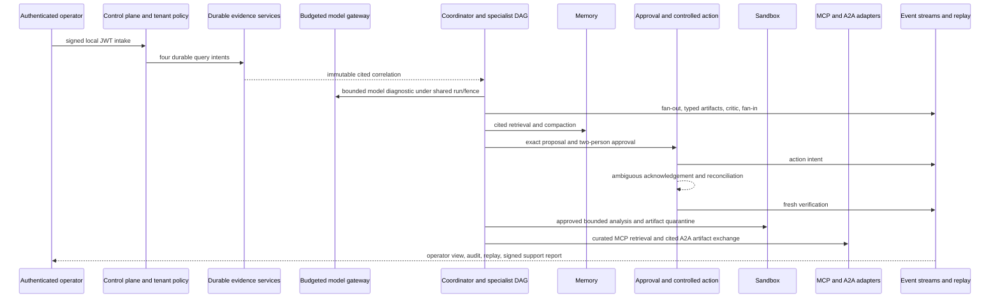

# Layer 16 final qualification

## Claim boundary

Layer 16 is the final **repository and bounded-local qualification** layer. It
does not certify Aegis for production and does not turn test, telemetry,
support, benchmark, or deployment evidence into run-state truth. Live accounts,
clouds, clusters, users, providers, partners, traffic, backups, failover, paging,
and organizational controls remain separate go-live evidence.

The authoritative runtime invariant is unchanged: each subsystem's append-only
event stream is truth; projections, indexes, caches, queues, traces, UI state,
reports, and the qualification archive are derived.

## Machine-runnable canonical journey

```bash
make qualification-demo
jq '.ledger, .assertions' \
  .aegis-qualification/demo/checkout-qualification-result.json
```

The command uses a signed ephemeral local JWT and no external network or
production credential. It executes:



The primary tenant, incident, and run IDs are shared across intake, evidence,
gateway, agents, remediation, sandbox, and protocols. Memory also creates a
second tenant solely to assert retrieval isolation. The event export contains
the original redacted envelopes from security audit, evidence, gateway,
specialist, memory, remediation, sandbox, MCP, and A2A streams.

## Persistence and replay

`QualificationArchive` writes an atomic JSONL export. Each record binds archive
position, source boundary, prior-record digest, and the complete serialized
`EventEnvelope`. Reload verifies the contiguous position and SHA-256 chain
before decoding legacy-compatible envelopes.

The runner builds a disposable projection before export and after reload. Both
digests must match. It then uses the read-only `ReplayDebugger` against the
specialist stream, validates sequence/version/cursor rules, and emits a bounded
HMAC-signed support report with hashed tenant and aggregate references.

This proves archive integrity and deterministic projection rebuilding for the
fixture. It does not prove database backup durability, managed restore, or
production volume.

## Required assertions

- authenticated principal and policy are tenant-bound;
- evidence query intent precedes every fake connector read;
- citations carry the ingested URI and content digest;
- model route/request/reservation precede provider execution;
- specialist dispatch precedes execution, the critic runs, and the projection
  rebuild is identical;
- two distinct approvers bind exact plan and policy digests;
- action intent precedes the fake effect, ambiguity is reconciled before retry,
  and verification is separate;
- sandbox provisioning intent precedes backend use and the untrusted artifact is
  quarantined;
- memory retrieval excludes the second tenant and compaction remains cited;
- MCP and A2A complete only through curated, digest-bound fake adapters;
- the operator journey labels event facts, derived state, and model claims;
- the archive hash chain, replay validation, and projection digest converge;
- the output explicitly denies live network, production credentials,
  exactly-once execution, production readiness, and certification.

## Release gates

```bash
make qualification-check
make qualification-demo
make qualification-chaos
make qualification-load
make qualification
```

`make qualification` is bounded and hermetic. PostgreSQL/pgvector/Redis,
frontend browsers, Compose, Kubernetes, Terraform, containers, SBOM/signing, and
managed restore have separate commands because their tool or environment
requirements differ.

## Evidence index

| Question | Authoritative release artifact |
| --- | --- |
| What is implemented or still gated? | [Production-readiness scorecard](production-readiness-scorecard.md) |
| What can still go wrong? | [Residual risk register](../qualification/residual-risks.json) |
| Which adversarial threats were tested? | [Security assessment](security-assessment.md) |
| Which failure cuts and budgets apply? | [Performance and chaos qualification](performance-chaos-qualification.md) |
| How is the system operated? | [Operational acceptance](operational-acceptance.md) |
| How do controls map to audit concepts? | [Compliance control map](compliance-control-map.md) |
| How should a learner traverse the repository? | [Start-to-expert learning path](learning-path.md) |
| What must a future framework implementation match? | [Framework comparison handoff](framework-comparison-handoff.md) |
| Which repository settings are required? | [Repository governance](repository-governance.md) |
