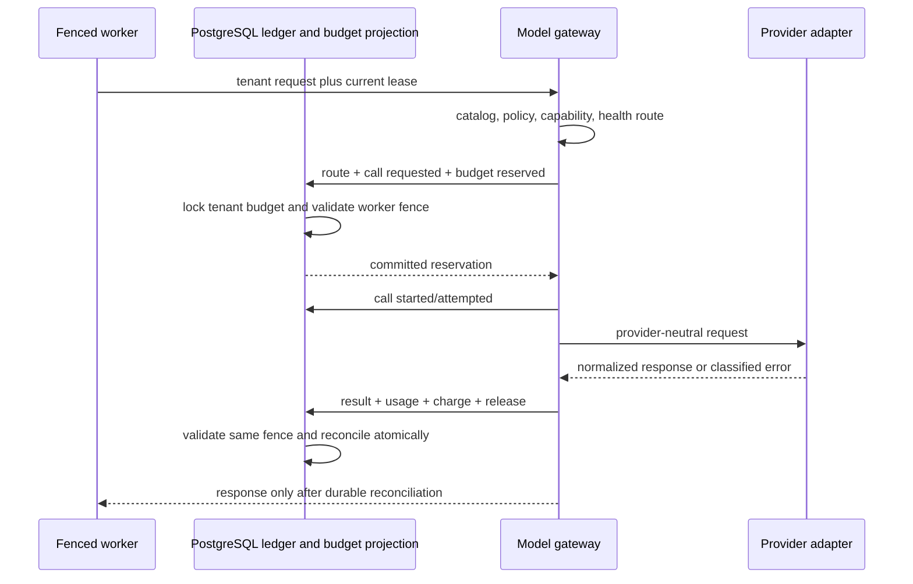

# Provider-neutral model gateway

Layer 5 adds a durable, tenant-governed model-call path without adding agent
orchestration. The ledger remains truth. Provider SDK objects exist only in
`providers/openai.py` and `providers/anthropic.py`; routing, policy, budgets,
usage, and errors use immutable domain contracts.

## Durable call flow



`model.call_requested.v1` and `model.budget_reserved.v1` commit before network
I/O. Every subsequent event and budget mutation checks the Layer 4 lease token
and generation. A stale worker cannot invoke after reservation fails and cannot
surface a response when post-call reconciliation fails.

## Provider abstraction tutorial

`domain.model` defines text/image/tool content parts, role-specific messages,
JSON Schemas, tool definitions and proposals, model capabilities and identity,
finish/safety results, five token classes, versioned pricing, latency, and
classified failures. Tuples and recursively frozen mappings prevent caller
aliasing. Vendor types stop at adapters.

To add a provider:

1. Implement `ModelProvider.complete`.
2. Translate every supported neutral content part explicitly.
3. Resolve a tenant-owned `SecretReference` only during lazy client creation.
4. Configure explicit HTTPS, TLS verification, proxy, timeout, and pool bounds;
   the HTTP client uses `trust_env=False`, so ambient credentials/proxies are not
   forwarded.
5. Normalize usage and provider request IDs. Reject missing, negative, oversized,
   or malformed fields.
6. Convert every SDK exception into `ModelGatewayError`; no SDK exception may
   cross the adapter.
7. Add mocked-transport contract tests. CI never uses live credentials or calls
   provider networks.

`await reload_client()` is the key-rotation boundary: after callers drain active
requests, close the pooled HTTP client so the next request resolves the configured
secret reference again. Production
deployments should use a vault-backed `SecretProvider` (still planned), private
egress where available, audited proxy policy, certificate verification, and
provider accounts scoped per environment.

## Routing tutorial

`ModelRouter` is deterministic. An explicit requested model is considered first;
unknown identities fail closed. It then filters by tenant/model/provider
allowlists, deployment environment, residency, provider retention policy,
current circuit availability, context/output limits, and required tool, vision,
or structured-output capability. Remaining candidates sort by configured
cost/latency ranks and stable model identity. Events store bounded candidate
count and reason codes, never prompt text.

The catalog is configuration, not discovery. Every entry requires explicit
capabilities, environments, residency, retention behavior, ranks, and a
`PricingVersion`. There is no "default model" or unknown-price fallback.

## Budget and cost accounting tutorial

Before a call, the gateway reserves worst-case input-estimate plus maximum output
tokens and the highest estimated cost among the bounded fallback candidates.
PostgreSQL serializes reservations through a tenant budget lock, verifies the
authoritative quota projection, and checks tenant-period plus run limits in the
same transaction as the intent events. Insufficient budget denies before network.

Success records input, output, cache-read, cache-write, and reasoning tokens;
applies the exact catalog price version used by the successful model; charges
actual cost; and releases the difference. Failure releases the reservation but
marks whether provider billing is ambiguous. Projections are disposable and can
be rebuilt from model budget/usage events. Historical usage retains the applied
price version.

Prompt estimates are caller-supplied conservative values in this layer; a
provider-specific tokenizer service is not implemented. Operators should watch
reservation drift and reject workloads whose estimator cannot bound context.

## Structured output and tools

JSON Schema uses Draft 2020-12 validation. The schema itself is validated before
use, provider JSON must decode to an object, the returned object must validate
strictly, and each proposed tool name/argument object is validated against the
registered request definition. Missing structure, unknown tools, refusals,
malformed JSON, and invalid usage remain explicit outcomes. There is no parser
fallback, coercion, or success-shaped default.

Automatic repair is deliberately **not implemented**. A future repair would be a
new durable model call with a new reservation and visible cost, never an
unmetered parser retry.

## Retry, failover, and circuit breakers

Per catalog model, runtime controls enforce bounded concurrency, request and
token buckets, and a closed/open/half-open circuit. Retry attempts and failovers
are separately bounded. Backoff is exponential with injected jitter, clock, and
sleep functions so tests are deterministic.

Only classified transient, timeout, rate-limit, or provider-unavailable failures
are retryable. Authentication, authorization, invalid request, capability,
safety, schema, malformed response, cancellation, and SDK-bug failures are not
retried. A retry-after value is honored when valid. Failover remains inside the
pre-reserved candidate bound.

## Exactly-once billing limits

Provider delivery is at-least-once. A timeout or disconnect may occur after the
provider accepted and billed a request but before Aegis receives the response.
An idempotency header is forwarded where supported, but providers do not offer a
uniform exactly-once billing contract. Aegis records `billing_ambiguous=true`,
does not invent usage, and releases local capacity; an operator must reconcile
against provider usage exports/request IDs. Retrying an ambiguous request can
duplicate provider charges even when Aegis records one logical call.

PostgreSQL reservation idempotency prevents a second worker from starting the
same logical request. Because raw responses are not persisted in this layer, a
completed response cannot be reconstructed after process loss. Encrypted durable
response artifacts and provider billing reconciliation are known follow-ups.

## Content persistence and telemetry policy

The ledger persists tenant/run/request references, selected bounded catalog
identity, message count, token estimates, capability flags, a SHA-256 content
digest, route reasons, error codes, provider request ID, token usage, price
version, cost, latency, and reservation reconciliation. It does **not** persist
raw prompts, message content, tool arguments/results, images, API keys, SDK
objects, or provider exception text.

The in-process scripted diagnostic keeps content only in memory. Production
content persistence requires a separately authorized encrypted artifact store
with tenant keys, classification, retention, deletion, and audit; that store is
planned. OTel spans use only catalog-bounded provider/model attributes. Metrics
never label tenant, run, request, or provider-request identifiers.

## Safe diagnostic

Run the deterministic mock path:

```bash
python -m aegis_agent_platform.gateway \
  --prompt "Why must budget reservation precede network I/O?"
```

It exercises routing, reservation, mock invocation, usage charge, and event
ordering without a credential or network. Authorized read-only API views expose
`/v1/tenants/{tenant}/models`, `/model-usage`, and `/provider-health`; they return
only tenant-allowed catalog entries and bounded circuit/usage data.
